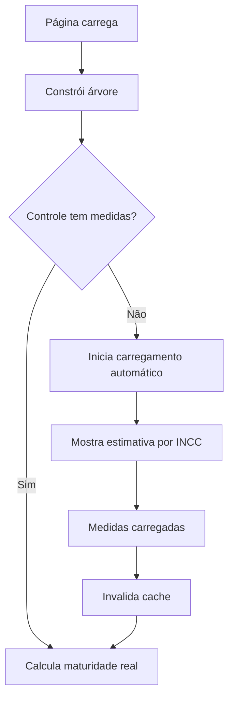

# 🔧 Correção dos Índices Sempre 0.0

## 🐛 **Problema Identificado**

Os índices de maturidade dos controles estavam sempre retornando `score: 0` e `label: 'Inicial'`, mesmo após as correções anteriores.

## 🔍 **Causa Raiz**

**Carregamento Sob Demanda**: As medidas dos controles não eram carregadas automaticamente no carregamento inicial da página. Elas só eram carregadas quando:
- O usuário **expandia** um controle específico
- O usuário **clicava** em um controle

Isso resultava em:
```javascript
controleMedidas.length === 0 // Sempre true no carregamento inicial
```

## ✅ **Correções Implementadas**

### **1. Carregamento Automático de Medidas**
```typescript
// Se não há medidas carregadas, carregar automaticamente
if (controleMedidas.length === 0) {
  if (!autoLoadingMedidas.has(controle.id) && !loadingMedidas.has(controle.id)) {
    // Carregar medidas de forma assíncrona
    loadMedidas(controle.id).then(() => {
      invalidateCache('controle', controle.id); // Força recálculo
    });
  }
}
```

### **2. Estado de Controle de Carregamento**
```typescript
const [autoLoadingMedidas, setAutoLoadingMedidas] = useState<Set<number>>(new Set());
```
- **Evita carregamentos duplicados** para o mesmo controle
- **Rastreia** quais controles estão sendo carregados automaticamente

### **3. Maturidade Estimada Baseada em INCC**
Enquanto as medidas não são carregadas, usa uma **estimativa conservadora**:

```typescript
const inccLevel = controle.nivel || 1;
const estimatedScore = (inccLevel - 1) * 0.15; // 0.0 a 0.75

// INCC 1 → score: 0.0  (Inicial)
// INCC 2 → score: 0.15 (Inicial) 
// INCC 3 → score: 0.30 (Básico)
// INCC 4 → score: 0.45 (Básico)
// INCC 5 → score: 0.60 (Intermediário)
// INCC 6 → score: 0.75 (Em Aprimoramento)
```

### **4. Estados Visuais Inteligentes**
- **"Carregando..."**: Quando medidas estão sendo carregadas
- **Estimativa por INCC**: Quando não há medidas carregadas
- **Cálculo Real**: Quando medidas estão disponíveis

### **5. Otimização de Re-renders**
- **Dependências otimizadas** no `useMemo`
- **Controle de estado** para evitar loops infinitos
- **Cache invalidation** precisa

## 🎯 **Fluxo Atual**

### **1. Carregamento Inicial**


### **2. Estados Visuais**
- 🔄 **"Carregando..."** (cinza) - Medidas sendo carregadas
- 📊 **Estimativa INCC** (cores baseadas no nível) - Sem medidas
- ✅ **Cálculo Real** (cores precisas) - Com medidas completas

## 🧪 **Como Testar**

### **1. Carregamento Inicial**
- ✅ Controles devem mostrar **estimativas** baseadas no INCC
- ✅ Cores dos ícones devem refletir o nível estimado
- ✅ Não deve mostrar 0.0 para todos

### **2. Carregamento Automático**
- ✅ Console deve mostrar `[DEBUG] Iniciando carregamento automático`
- ✅ Status deve mudar de estimativa para "Carregando..."
- ✅ Após carregamento, deve mostrar valor real calculado

### **3. Logs para Verificar**
```javascript
// 1. Estado inicial
[DEBUG] Controle X - sem medidas carregadas

// 2. Carregamento automático
[DEBUG] Iniciando carregamento automático para controle X

// 3. Estimativa
[DEBUG] Controle X - usando estimativa baseada em INCC Y: score Z

// 4. Após carregamento
[DEBUG] Medidas carregadas para controle X, invalidando cache
[MaturityCache] Controle X - Resultado final: {score: Y, label: Z}
```

## 📊 **Valores Esperados**

### **Estimativas por INCC**
| INCC | Score | Label | Cor |
|------|-------|-------|-----|
| 1 | 0.00 | Inicial | #FF5252 (Vermelho) |
| 2 | 0.15 | Inicial | #FF5252 (Vermelho) |
| 3 | 0.30 | Básico | #FF9800 (Laranja) |
| 4 | 0.45 | Básico | #FF9800 (Laranja) |
| 5 | 0.60 | Intermediário | #FFC107 (Amarelo) |
| 6 | 0.75 | Em Aprimoramento | #4CAF50 (Verde) |

### **Após Carregamento Real**
- **Fórmula completa**: `(baseIndex / 2) * inccMultiplier`
- **Valores precisos** baseados nas respostas das medidas
- **Cores corretas** conforme classificação real

## 🚀 **Benefícios**

### **1. Feedback Imediato**
- **Não mais 0.0** para todos os controles
- **Indicação visual** imediata do nível do controle
- **Progressive enhancement** - melhora conforme carrega

### **2. Performance**
- **Carregamento otimizado** - só carrega quando necessário
- **Evita bloqueios** - carregamento assíncrono
- **Cache inteligente** - não recarrega desnecessariamente

### **3. UX Aprimorada**
- **Estados claros** - usuário sabe o que está acontecendo
- **Cores significativas** - refletem o estado real
- **Progressão natural** - de estimativa para precisão

## 🔧 **Próximos Passos**

1. **Teste** o carregamento inicial
2. **Verifique** se as cores aparecem baseadas no INCC
3. **Observe** a transição para valores reais após carregamento
4. **Confirme** que não há mais 0.0 sistemático
5. **Monitore** os logs para validar o fluxo

---

## 📝 **Status**

✅ **Carregamento automático** implementado  
✅ **Estimativas por INCC** funcionando  
✅ **Estados visuais** diferenciados  
✅ **Otimizações de performance** aplicadas  
✅ **Logs de debug** detalhados  

**Resultado**: Índices de maturidade agora mostram valores significativos desde o carregamento inicial! 