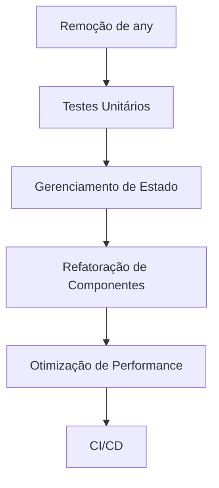

# Plano de Refatoração - FPSI

## 1. Visão Geral

Este plano de refatoração visa melhorar a qualidade do código, manutenibilidade e performance do FPSI, mantendo a funcionalidade existente e minimizando riscos.

## 2. Priorização de Mudanças

### 2.1 Prioridade Alta (Sprint 1-2)
1. **Remoção de `any` e Melhoria de Tipagem**
   - Criar interfaces para todos os tipos
   - Remover uso de `any` em props
   - Implementar tipagem estrita
   - **Impacto**: Alta
   - **Complexidade**: Média
   - **Risco**: Baixo

2. **Implementação de Testes Unitários**
   - Configurar Jest e React Testing Library
   - Implementar testes para componentes críticos
   - Adicionar testes de integração
   - **Impacto**: Alta
   - **Complexidade**: Média
   - **Risco**: Baixo

3. **Melhoria do Gerenciamento de Estado**
   - Implementar Context API consistente
   - Criar hooks personalizados
   - Remover prop drilling
   - **Impacto**: Alta
   - **Complexidade**: Alta
   - **Risco**: Médio

### 2.2 Prioridade Média (Sprint 3-4)
1. **Refatoração de Componentes**
   - Implementar padrão Container/Presenter
   - Melhorar composição de componentes
   - Reduzir duplicação de código
   - **Impacto**: Média
   - **Complexidade**: Média
   - **Risco**: Médio

2. **Otimização de Performance**
   - Implementar memoização
   - Otimizar re-renders
   - Melhorar lazy loading
   - **Impacto**: Média
   - **Complexidade**: Baixa
   - **Risco**: Baixo

3. **Melhoria de Documentação**
   - Adicionar JSDoc
   - Atualizar README
   - Documentar decisões técnicas
   - **Impacto**: Média
   - **Complexidade**: Baixa
   - **Risco**: Baixo

### 2.3 Prioridade Baixa (Sprint 5-6)
1. **Implementação de CI/CD**
   - Configurar GitHub Actions
   - Implementar pipeline de testes
   - Configurar deploy automático
   - **Impacto**: Baixa
   - **Complexidade**: Média
   - **Risco**: Baixo

2. **Melhorias de UX**
   - Implementar feedback de loading
   - Melhorar tratamento de erros
   - Adicionar animações
   - **Impacto**: Baixa
   - **Complexidade**: Baixa
   - **Risco**: Baixo

## 3. Dependências entre Mudanças

### 3.1 Dependências Diretas

### 3.2 Dependências Técnicas
- Testes Unitários dependem da tipagem correta
- Refatoração de Componentes depende do gerenciamento de estado
- CI/CD depende dos testes unitários
- Documentação pode ser feita em paralelo

## 4. Riscos e Mitigações

### 4.1 Riscos Técnicos
1. **Quebra de Funcionalidade**
   - **Risco**: Alto
   - **Mitigação**: 
     - Implementar testes antes da refatoração
     - Fazer mudanças incrementais
     - Manter ambiente de staging

2. **Performance Degradada**
   - **Risco**: Médio
   - **Mitigação**:
     - Monitorar métricas de performance
     - Implementar benchmarks
     - Fazer testes de carga

3. **Conflitos de Merge**
   - **Risco**: Médio
   - **Mitigação**:
     - Manter branches atualizados
     - Fazer merges frequentes
     - Usar feature flags

### 4.2 Riscos de Negócio
1. **Tempo de Desenvolvimento**
   - **Risco**: Alto
   - **Mitigação**:
     - Priorizar mudanças críticas
     - Manter funcionalidades existentes
     - Fazer entregas incrementais

2. **Recursos Limitados**
   - **Risco**: Médio
   - **Mitigação**:
     - Focar em mudanças de alto impacto
     - Automatizar processos
     - Documentar bem para facilitar onboarding

## 5. Timeline

### 5.1 Sprint 1 (2 semanas)
- Configuração de ambiente de testes
- Remoção de `any` em componentes críticos
- Implementação de testes básicos

### 5.2 Sprint 2 (2 semanas)
- Implementação de Context API
- Criação de hooks personalizados
- Testes de integração

### 5.3 Sprint 3 (2 semanas)
- Refatoração de componentes principais
- Implementação de memoização
- Melhorias de performance

### 5.4 Sprint 4 (2 semanas)
- Documentação técnica
- Melhorias de UX
- Testes de regressão

### 5.5 Sprint 5 (2 semanas)
- Configuração de CI/CD
- Implementação de pipeline
- Testes de carga

### 5.6 Sprint 6 (2 semanas)
- Finalização de documentação
- Melhorias finais
- Deploy em produção

## 6. Métricas de Sucesso

### 6.1 Técnicas
- Cobertura de testes > 80%
- Zero uso de `any`
- Redução de 50% em re-renders
- Tempo de build < 5 minutos

### 6.2 Negócio
- Zero bugs críticos
- Tempo de resposta < 200ms
- Satisfação do usuário > 90%
- Manutenção mais rápida

## 7. Processo de Validação

### 7.1 Code Review
- Checklist de qualidade
- Revisão de pares
- Validação de testes

### 7.2 QA
- Testes de regressão
- Testes de performance
- Validação de UX

### 7.3 Produção
- Deploy gradual
- Monitoramento
- Rollback plan

## 8. Manutenção

### 8.1 Pós-Refatoração
- Monitoramento contínuo
- Coleta de feedback
- Ajustes incrementais

### 8.2 Documentação
- Atualização de documentação
- Registro de lições aprendidas
- Guias de manutenção 