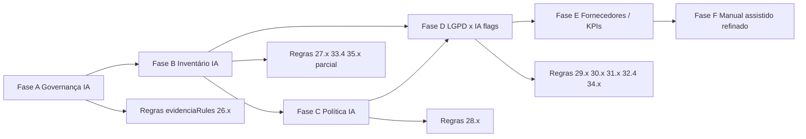

# Sistematização — Diagnóstico AIGP × módulos do FPSI

Documento de **produto e arquitetura** (sem implementação). Objetivo: cruzar as **54 medidas** do domínio **Governança de IA** (`diagnostico_id = 4`, índice `iAIGP`) com os **dados e módulos já existentes** no FPSI, identificar lacunas e propor **ações sistemáticas** para auxílio ao preenchimento — no mesmo espírito da evidência assistida do PPSI Estrutura ([`MEDIDAS_FONTE_EVIDENCIA.md`](../essentials/systems/MEDIDAS_FONTE_EVIDENCIA.md)).

**Catálogo canônico:** [`catalogo_aigp_v1.json`](./catalogo_aigp_v1.json)  
**Visão geral do domínio:** [`GOVERNANCA_IA_AIGP.md`](./GOVERNANCA_IA_AIGP.md)  
**Implementação atual de sugestões:** [`evidenciaRules.ts`](../../src/lib/medidas/evidenciaRules.ts) + UI em [`Medida/index.tsx`](../../src/components/diagnostico/Medida/index.tsx)

---

## 1. Problema que estamos resolvendo

Hoje o usuário responde medidas AIGP **manualmente**, em escala 1–6, sem o FPSI inferir respostas a partir do que já cadastrou em governança, conformidade, políticas etc.

No diagnóstico **Estrutura (PPSI)**, medidas `0.1`–`0.8` já fazem o caminho inverso desejado:

1. O sistema lê papéis e comitês em **Estrutura de Governança**.
2. Sugere **Sim/Não** com motivo e confiança.
3. Oferece link **“Abrir Estrutura de Governança”** (`?aba=equipe|si|priva|etir`).

Para **Governança de IA**, o catálogo fala explicitamente de **comitês, papéis, inventário, política de IA, RIPD, incidentes, fornecedores** — entidades que o FPSI **já cobre em parte** (PPSI/LGPD), mas **sem modelo nem regras AIGP**. Resultado: lacuna de produto e retrabalho para o avaliador.

---

## 2. Princípios (herdados do PPSI)

| Princípio | Aplicação ao AIGP |
|-----------|-------------------|
| **Assistido, não automático** | Sugestão + botão “Aplicar”; resposta oficial continua em `programa_medida`. |
| **Cadastro ≠ ato institucional** | Indicar no motivo que falta portaria/ata quando só há registro no FPSI. |
| **Link para onde preencher** | Toda regra com fonte no produto deve ter `governancaContexto` ou equivalente (deep link ao módulo). |
| **Proporcionalidade (G1/G2/G3)** | Regras de evidência podem ser mais exigentes para G2/G3; G1 prioriza baseline documentável. |
| **Reuso antes de módulo novo** | Estender campos/abas existentes quando a medida aceita equivalência (ex.: comitê dedicado **ou** CSI/CPDP com IA na pauta). |
| **Manual quando não há entidade** | Testes OWASP, drift em produção, fairness quantitativo — orientação + plano de ação, sem fingir inferência. |

---

## 3. Inventário do FPSI relevante para AIGP

### 3.1 Já existe e pode alimentar evidência

| Módulo | Rota / entidade | Dados úteis para AIGP |
|--------|-----------------|------------------------|
| **Estrutura de Governança** | `/programas/[id]/responsabilidades` | 5 papéis PPSI; comitês SI, privacidade, ETIR; diagrama de tratamento |
| **Políticas** | `/programas/[id]/politicas` | PGSI, PGP, POSIN, proteção de dados, provedor de serviços, logs/auditoria… (`politica_programa`) |
| **Mapeamento de dados** | `/conformidade/mapeamento` | Levantamentos por área/finalidade/meios (sem flag IA hoje) |
| **ROPA** | `/conformidade/ropa` | Operações, bases legais, titulares, compartilhamentos |
| **RIPD / AIPD** | `/conformidade/ripd` | Riscos, `decisao_automatizada`, nível de risco, parecer DPO |
| **Incidentes** | `/conformidade/incidentes` | Registro de incidentes (sem tipo “IA” hoje) |
| **Pedidos de titulares** | `/conformidade/pedidos-titulares` | Canal art. 20 / contestação |
| **Portal do titular** | `/conformidade/portal` + slug público | Transparência, avisos, política pública |
| **Gestão de riscos** | `/programas/[id]/riscos` | `programa_risco` (categorias: privacidade, SI, conformidade…) |
| **Plano de ação** | `/programas/[id]/planos-acao` | Ações vinculadas a medidas do diagnóstico |
| **Auditoria** | `/programas/[id]/auditoria` | Trilha `user_activities` |
| **Diagnóstico (scores)** | `/programas/[id]/diagnostico` | iAIGP, iMC SI, iMC Privacidade, iMC Estrutura |
| **Referências AIGP** | `/referencias/aigp` | Normas nos chips das medidas (consulta, não evidência) |

### 3.2 Não existe (lacunas estruturais)

| Necessidade AIGP | Situação atual |
|------------------|----------------|
| Responsável / substituto por **governança de IA** | Não há campo em `programa` |
| **Comitê de IA** ou flag “IA na pauta” em comitês existentes | Só `comite_seguranca_informacao`, `comite_protecao_dados`, `etir` |
| **Inventário de sistemas de IA** | Não há tabela/módulo |
| **Política de IA / uso de GenAI** | Não há `tipo_politica` dedicado |
| **Avaliação de risco de IA** (pré-deploy, model card) | Riscos genéricos existem; sem vínculo a sistema de IA |
| **Due diligence de fornecedor de IA** | Política de provedor existe; sem checklist IA |
| **Gate / ciclo de vida de IA** | Não modelado |
| **Regras `evidenciaRules` para ids `26.x`–`35.x`** | Nenhuma |

### 3.3 Mecanismo técnico atual

- `MedidaContainer` monta `EvidenciaContext` e chama `getEvidenciaSugestao(id_medida, ctx)`.
- Para diagnóstico 4, **nenhum id AIGP tem case** → mensagem genérica “Não há correspondência automática…”.
- A UI de sugestão + link **já está pronta**; falta **dados + regras + destinos de navegação**.

---

## 4. Roadmap proposto (fases de produto)

### Fase A — Governança estendida (P0)

**Objetivo:** cobrir Controle 26 (accountability) com o mesmo padrão das medidas `0.x`.

| Ação | Descrição |
|------|-----------|
| A.1 | Campo `responsavel_governanca_ia` (+ opcional `substituto_governanca_ia`) em `programa`, aba **Equipe** |
| A.2 | Grupo `comite_governanca_ia` em `programa_grupo_governanca` **ou** flags `ia_na_pauta` nos grupos SI/priva/ETIR |
| A.3 | Aba `?aba=ia` em Estrutura de Governança (atualizar `GOVERNANCA_ABA_QUERY`) |
| A.4 | Regras evidência: `26.1`, `26.2`, `26.3` (parcial), links profundos |
| A.5 | Documentar orientação na cartilha (`governancaOrientacaoPrograma.ts`) |

**Medidas impactadas:** 26.1, 26.2, 26.3 (parcial), 26.5 (parcial via scores PPSI).

### Fase B — Inventário de IA (P0)

**Objetivo:** desbloquear Controle 27 e parte de 33, 35.

| Ação | Descrição |
|------|-----------|
| B.1 | Tabela `sistema_ia` (ou `inventario_ia`): nome, finalidade, dono negócio, resp. técnico, tipo (próprio/SaaS/API), nível risco, status ciclo, flags decisão automatizada |
| B.2 | UI `/programas/[id]/conformidade/inventario-ia` ou sub-rota em conformidade |
| B.3 | FK opcional `sistema_ia_id` em `mapeamento_dados` / `ropa` / `ripd` |
| B.4 | Gate “só produção se inventariado” (campo `data_entrada_producao` + workflow simples) |
| B.5 | Regras evidência: `27.1`–`27.5`, `33.4` |

**Medidas impactadas:** 27.x, 33.4, 35.1 (parcial), 35.5, 35.6 (KPI % inventário).

### Fase C — Política e documentos de IA (P1)

| Ação | Descrição |
|------|-----------|
| C.1 | Modelo `politica_governanca_ia` + seções (princípios, GenAI, usos proibidos, revisão) |
| C.2 | Template seed + export PDF como demais políticas |
| C.3 | Campos `inicio_vigencia` / `prazo_revisao` para inferir 28.4 |
| C.4 | Regras evidência: `28.1`, `28.2` (seção GenAI), `28.4`, `28.5` (checklist manual assistido) |

### Fase D — Conformidade LGPD × IA (P1)

| Ação | Descrição |
|------|-----------|
| D.1 | Flag `usa_ia` / `decisao_automatizada` em mapeamento e ROPA |
| D.2 | Tipo de risco `ia` / `decisao_automatizada` já parcial em RIPD — ampliar vínculo a `sistema_ia_id` |
| D.3 | Categoria `ia` em `programa_risco` + origem `sistema_ia` |
| D.4 | Tipo incidente `ia` + playbook texto em política POSIN ou anexo |
| D.5 | Regras evidência: 29.4, 30.x, 31.3, 34.x (parcial) |

### Fase E — Fornecedores, ciclo de vida, KPIs (P2)

| Ação | Descrição |
|------|-----------|
| E.1 | Extensão inventário: fornecedor, ToS training opt-out, subprocessadores, região |
| E.2 | Checklist due diligence (campos booleanos + anexo) por sistema |
| E.3 | Estados de ciclo de vida + gate checklist (35.1, 35.2, 35.5) |
| E.4 | Dashboard KPIs AIGP na home do programa (35.6) |
| E.5 | Capacitação: registro simples de treinamentos (35.3) — ou plano de ação tipo “capacitação” |

### Fase F — O que permanece manual assistido (P3)

Medidas que exigem **processo organizacional** ou **evidência externa** (testes, métricas em runtime). O FPSI deve:

- Mostrar **orientação** + link para módulo relacionado quando existir.
- Sugerir **criar item no plano de ação** pré-preenchido.
- **Não** inferir nível 1–6 sem dados (evitar falsa confiança).

---

## 5. Matriz medida a medida

Legenda **Evidência hoje:**

| Código | Significado |
|--------|-------------|
| ❌ | Sem regra; preenchimento manual |
| 🔶 | Dados parciais no FPSI; regra possível com ressalvas |
| ✅ | Regra implementável quando fase correspondente estiver pronta |
| 📋 | Manual permanente; apenas orientação + plano de ação |

Legenda **Prioridade:** P0 (bloqueia valor AIGP) · P1 (alto retorno) · P2 · P3

---

### Controle 26 — Governança e accountability de IA

| id | Medida (resumo) | GI | Evidência hoje | Fonte FPSI atual | Lacuna | Ação sugerida | Fase |
|----|-----------------|----|----------------|------------------|--------|---------------|------|
| **26.1** | Accountability formal (resp., substituto, escopo) | G1 | ❌ | Representante alta admin (aproximação fraca) | Papel específico IA + substituto | Campo(s) governança IA; regra binária/maturidade se escala adaptada | A |
| **26.2** | Comitê/fórum de IA ou tema na pauta | G1 | 🔶 | Comitês SI/priva/ETIR (membros) | Comitê IA ou flag “IA na pauta” + atas (fora do sistema) | Grupo `comite_governanca_ia` **ou** flags; link `?aba=ia` / `si` / `priva`; motivo explícito sobre atas | A |
| **26.3** | RACI negócio/TI/privacidade/SI/jurídico | G1 | 🔶 | 5 papéis PPSI na equipe | Jurídico, negócio, RACI por sistema | Checklist “papéis mínimos preenchidos”; futuro RACI por `sistema_ia`; regra parcial (≥N papéis) | A + B |
| **26.4** | Canal reporte/escalonamento à alta admin | G2 | 🔶 | Incidentes, riscos, plano de ação | Canal específico IA + critérios | Tipo incidente/risco IA; template plano; link incidentes/riscos; 📋 critérios escritos | D + E |
| **26.5** | Integração IA ↔ PPSI / riscos institucionais | G2 | 🔶 | Scores diagnóstico + módulo riscos | Riscos sem tag IA | Regra composta: iAIGP + iMC SI/Priv + ≥1 risco categoria IA; KPI dashboard | D + E |

---

### Controle 27 — Inventário e classificação de sistemas de IA

| id | Medida (resumo) | GI | Evidência hoje | Fonte FPSI atual | Lacuna | Ação sugerida | Fase |
|----|-----------------|----|----------------|------------------|--------|---------------|------|
| **27.1** | Inventário atualizado (SaaS, GenAI, APIs…) | G1 | ❌ | — | Módulo inventário | Contagem `sistema_ia` ativos; link inventário | B |
| **27.2** | Dono negócio + resp. técnico por sistema | G1 | ❌ | Responsáveis genéricos | Donos por sistema | Campos obrigatórios no inventário | B |
| **27.3** | Classificação risco/impacto documentada | G1 | ❌ | — | Enum risco + critérios | Campo `nivel_risco` + texto critérios programa | B |
| **27.4** | Vínculo negócio + ROPA/mapeamento | G2 | 🔶 | ROPA + mapeamento existem | Sem FK IA | `sistema_ia_id` opcional; regra: ≥1 sistema com ROPA vinculado | B + D |
| **27.5** | Gate antes de produção/uso amplo | G2 | ❌ | — | Workflow onboarding | Status `rascunho→aprovado→producao`; bloqueio soft na UI | B |

---

### Controle 28 — Política e princípios de IA responsável

| id | Medida (resumo) | GI | Evidência hoje | Fonte FPSI atual | Lacuna | Ação sugerida | Fase |
|----|-----------------|----|----------------|------------------|--------|---------------|------|
| **28.1** | Política de IA aprovada | G1 | ❌ | Políticas diversas | Política IA dedicada | `politica_governanca_ia` com conteúdo | C |
| **28.2** | Diretrizes GenAI/copiloto | G1 | ❌ | — | Seção GenAI | Seção template + regra “seção preenchida” | C |
| **28.3** | Comunicação/capacitação princípios | G2 | 📋 | Política desenvolvimento pessoas (genérica) | Evidência de treinamento IA | Registro treinamentos ou plano ação; 📋 | E |
| **28.4** | Revisão periódica da política | G2 | 🔶 | `prazo_revisao` em políticas | Política IA + datas | Regra: política IA + vigência/revisão definida | C |
| **28.5** | Usos proibidos listados e monitorados | G3 | ❌ | — | Lista + monitoramento | Seção “usos proibidos” no template; 📋 monitoramento | C |

---

### Controle 29 — Gestão de riscos de IA

| id | Medida (resumo) | GI | Evidência hoje | Fonte FPSI atual | Lacuna | Ação sugerida | Fase |
|----|-----------------|----|----------------|------------------|--------|---------------|------|
| **29.1** | Avaliação risco pré-produção (mod/alto) | G1 | 🔶 | `programa_risco`, RIPD | Sem avaliação por sistema IA | Entidade `avaliacao_risco_ia` ou risco vinculado a `sistema_ia` pré-prod | B + D |
| **29.2** | Métricas fairness/robustez documentadas | G2 | 📋 | — | Métricas runtime | Model card / anexo; 📋 | E |
| **29.3** | Riscos residuais + planos tratamento | G1 | 🔶 | Riscos + plano ação medidas | Tag IA | Categoria `ia`; planos vinculados | D |
| **29.4** | AIPD/FRIA/RIPD ampliado | G2 | 🔶 | RIPD + `decisao_automatizada` | AIPD sem inventário IA | RIPD ligado a `sistema_ia`; contagem | D |
| **29.5** | Reassessment pós-mudança material | G2 | ❌ | — | Histórico versões | Log versão em inventário; 📋 | E |
| **29.6** | Thresholds / go-no-go | G3 | 📋 | Riscos (score) | Appetite IA formal | Campo programa “appetite IA”; 📋 | E |

---

### Controle 30 — Dados, privacidade e LGPD em IA

| id | Medida (resumo) | GI | Evidência hoje | Fonte FPSI atual | Lacuna | Ação sugerida | Fase |
|----|-----------------|----|----------------|------------------|--------|---------------|------|
| **30.1** | Base legal + finalidade (treino/inferência) | G1 | 🔶 | ROPA (base legal, finalidade) | Flag “usa IA” | Flag em ROPA/mapeamento; regra se ROPA IA com base legal | D |
| **30.2** | Minimização / sensíveis | G1 | 📋 | Categorias ROPA/RIPD | Minimização IA específica | Checklist RIPD ampliado; 📋 | D |
| **30.3** | Retenção prompts/logs | G1 | 📋 | Políticas retenção genéricas | Política logs IA | Seção política IA ou POSIN; 📋 | C |
| **30.4** | Salvaguardas art. 20 | G2 | 🔶 | Pedidos titulares, portal, DPO | Decisão automatizada IA | Encarregado + portal + pedidos; regra composta (similar 21.4) | D |
| **30.5** | RIPD antes deploy alto risco | G2 | 🔶 | RIPD count | RIPD × sistema alto risco | RIPD aprovado vinculado a sistema `risco_alto` | D |
| **30.6** | Contratos processadores IA | G2 | 🔶 | Política provedor, ROPA operadores | Cláusulas IA | Campos contrato/fornecedor no inventário; 📋 | E |

---

### Controle 31 — Transparência, explicabilidade e direitos

| id | Medida (resumo) | GI | Evidência hoje | Fonte FPSI atual | Lacuna | Ação sugerida | Fase |
|----|-----------------|----|----------------|------------------|--------|---------------|------|
| **31.1** | Notice uso de IA | G1 | 🔶 | Portal + docs públicos | Menção IA no aviso | Campo/check “menciona IA” em doc portal; 📋 | D |
| **31.2** | Explicabilidade alto impacto | G2 | 📋 | — | Model explainability | Model card; 📋 | E |
| **31.3** | Canal contestação/revisão humana | G1 | 🔶 | Pedidos titulares | Fluxo art. 20 explícito | Contagem pedidos + tipo; link pedidos | D |
| **31.4** | Disclosure conteúdo sintético | G2 | 📋 | — | Política comunicação | Seção política IA; 📋 | C |
| **31.5** | Model card risco mod/alto | G3 | ❌ | — | Anexo por sistema | Campo `model_card` / upload no inventário | B + E |

---

### Controle 32 — Segurança, robustez e monitoramento

| id | Medida (resumo) | GI | Evidência hoje | Fonte FPSI atual | Lacuna | Ação sugerida | Fase |
|----|-----------------|----|----------------|------------------|--------|---------------|------|
| **32.1** | Controle acesso modelos/datasets | G1 | 📋 | Medidas CIS/PPSI SI (parcial) | MLops específico | Link diagnóstico SI; 📋 | F |
| **32.2** | Monitoramento drift/erros | G1 | 📋 | — | Telemetria produção | Campo “monitoramento ativo” inventário; 📋 | E |
| **32.3** | Testes prompt injection etc. | G2 | 📋 | — | OWASP LLM | Checklist segurança anexo; 📋 | F |
| **32.4** | Incidentes IA ↔ ETIR | G2 | 🔶 | Incidentes + ETIR membros | Tipo incidente IA | `tipo=ia`; ETIR > 0; link incidentes/ETIR | D |
| **32.5** | Rollback / kill switch | G2 | 📋 | — | Runbook | Campo runbook URL/checklist inventário; 📋 | E |
| **32.6** | Dev isolado de produção | G3 | 📋 | Controles SI configuração | MLOps | Orientação + SI; 📋 | F |

---

### Controle 33 — Terceiros e modelos fundacionais

| id | Medida (resumo) | GI | Evidência hoje | Fonte FPSI atual | Lacuna | Ação sugerida | Fase |
|----|-----------------|----|----------------|------------------|--------|---------------|------|
| **33.1** | Due diligence IA | G1 | 🔶 | Política provedor | Questionário IA | Checklist due diligence no inventário (SaaS/API) | E |
| **33.2** | ToS training / opt-out | G1 | ❌ | — | Campos contrato | `permite_treino_fornecedor`, `opt_out` | E |
| **33.3** | Reavaliação mudanças fornecedor | G2 | 📋 | — | Change management | Data última revisão fornecedor; 📋 | E |
| **33.4** | IA embutida em terceiros no inventário | G2 | ❌ | — | Flag `ia_embutida` | Campo inventário; regra contagem | B |
| **33.5** | Exit / portabilidade | G3 | 📋 | — | Plano descontinuação | Checklist retire (35.5); 📋 | E |

---

### Controle 34 — Viés, equidade e impacto humano

| id | Medida (resumo) | GI | Evidência hoje | Fonte FPSI atual | Lacuna | Ação sugerida | Fase |
|----|-----------------|----|----------------|------------------|--------|---------------|------|
| **34.1** | Grupos impactados / discriminação | G1 | 🔶 | RIPD tipos risco | Stakeholders IA | Tipo risco `discriminacao` em RIPD IA; 📋 | D |
| **34.2** | Avaliação viés/equidade | G2 | 📋 | — | Fairness testing | Anexo avaliação; 📋 | F |
| **34.3** | Supervisão humana significativa | G1 | 📋 | Art. 20 fluxos | Processo humano | Pedidos + política; 📋 | D |
| **34.4** | Reclamações discriminação IA | G2 | 🔶 | Pedidos/reportes portal | Fluxo dedicado | Tipo pedido/reporte; 📋 | D |
| **34.5** | Impacto trabalhadores | G3 | 📋 | — | Workplace AI | Orientação; 📋 | F |

---

### Controle 35 — Ciclo de vida, documentação e auditoria

| id | Medida (resumo) | GI | Evidência hoje | Fonte FPSI atual | Lacuna | Ação sugerida | Fase |
|----|-----------------|----|----------------|------------------|--------|---------------|------|
| **35.1** | Gate aprovação pré-prod | G1 | ❌ | — | Workflow gate | Status inventário + checklist gate | B |
| **35.2** | Versionamento modelos/prompts | G1 | 📋 | Auditoria app | Versionamento ML | Histórico versão inventário; 📋 | E |
| **35.3** | Capacitação por papel | G2 | 📋 | Política desenvolvimento | Trilhas IA | Registro treinamento; 📋 | E |
| **35.4** | Auditoria interna governança IA | G2 | 🔶 | Módulo auditoria | Programa auditoria IA | Plano ação + amostra inventário; 📋 | E |
| **35.5** | Retire controlado | G2 | ❌ | — | Status `descontinuado` | Fluxo retire inventário | B |
| **35.6** | KPIs liderança (iAIGP etc.) | G3 | 🔶 | Score iAIGP dashboard | KPIs operacionais | Painel: % inventário, incidentes IA, RIPD IA | E |

---

## 6. Resumo quantitativo

| Situação | Qtd. medidas (≈) | % |
|----------|------------------|---|
| Regra implementável após **Fase A** (governança) | 3–5 | ~9% |
| Regra implementável após **Fase B** (inventário) | +8–10 | ~25% acum. |
| Regra implementável após **Fases C–D** (política + LGPD) | +12–15 | ~50% acum. |
| **Manual assistido** permanente (📋) | ~18–22 | ~35–40% |
| **Sem correspondência** (orientação genérica apenas) | restante até fechar fases | → tende a 0% “cego” |

*Nota: uma medida pode ter regra **parcial** (sugestão com confiança `baixa` + texto “confirme atas/processos externos”).*

---

## 7. Padrões de UX recomendados (quando implementar)

1. **Mesmo componente** de alerta `AutoAwesome` já usado em medidas `0.x`.
2. **Deep links** padronizados:

   | Contexto | Href |
   |----------|------|
   | Papéis IA | `/programas/{id}/responsabilidades?aba=equipe` |
   | Comitê IA | `?aba=ia` (novo) ou `?aba=si` / `?aba=priva` |
   | Inventário | `/programas/{id}/conformidade/inventario-ia` (novo) |
   | Política IA | `/programas/{id}/politicas` (+ query tipo) |
   | ROPA/RIPD | `/conformidade/ropa` / `ripd` |
   | Riscos IA | `/programas/{id}/riscos?categoria=ia` |
   | Plano de ação | `/programas/{id}/planos-acao` |

3. **Confiança `baixa`** quando faltar evidência institucional (ata, teste, métrica).
4. **Botão secundário** “Criar plano de ação” pré-preenchido para medidas 📋.
5. **Cross-diagnóstico:** medida 26.5 e 27.4 devem citar scores/links PPSI Privacidade/SI sem duplicar cadastro.

---

## 8. Dependências técnicas (referência para implementação futura)

| Item | Arquivos / tabelas tocados |
|------|----------------------------|
| Regras AIGP | `src/lib/medidas/evidenciaRules.ts`, `MEDIDAS_FONTE_EVIDENCIA.md` |
| Snapshot conformidade | `fetchEvidenciaConformidadeSnapshot` — estender com inventário IA, política IA |
| Governança | `programa`, `programa_grupo_governanca`, `abaGovernanca.ts`, `responsabilidades/page.tsx`, API `governanca-grupos` |
| Políticas | `politica_modelo`, seed migration, `politicasCatalog.ts` |
| Inventário IA | nova migration + rotas conformidade |
| Tipos evidência | estender `EvidenciaContext` com `inventarioIa`, `politicaIa`, flags comitê |

---

## 9. Ordem de execução recomendada

**Quick win documentado (sem código):** assim que Fase A existir, medidas **26.1** e **26.2** passam a ter paridade com **0.6**/**0.7** — resposta à pergunta original (“comitê na medida → preencher na governança”).

---

## 10. Critérios de aceite (produto)

- [ ] Avaliador abre medida **26.2** e vê sugestão + link para cadastro de comitê IA (ou SI/priva com flag pauta).
- [ ] Avaliador abre **27.1** e vê contagem de sistemas no inventário (0 → sugere nível 5 / “Não adota”).
- [ ] Medidas 📋 exibem orientação do catálogo + atalho “Plano de ação” quando não houver regra.
- [ ] Documento [`MEDIDAS_FONTE_EVIDENCIA.md`](../essentials/systems/MEDIDAS_FONTE_EVIDENCIA.md) ganha seção **Diagnóstico 4 — AIGP** espelhando esta matriz (quando regras forem codificadas).
- [ ] Nenhuma regra sugere nível 1–6 **alta confiança** sem predicado objetivo no banco.

---

## 11. Referências

- NIST AI RMF — funções Govern / Map / Measure / Manage (campo `funcao_nist` no catálogo)
- ISO/IEC 42001 — AIMS (política, papéis, ciclo de vida)
- IAPP AIGP — accountability e operacionalização
- PPSI 2.0 — integração SI/privacidade (controles 0.x, 19.x, 21.x já parcialmente mapeados em `evidenciaRules.ts`)
- LGPD arts. 6º, 20, 37, 38 — interseção tratada nos módulos conformidade existentes

---

*Última revisão: catálogo AIGP v1.0 · 54 medidas · FPSI pré-implementação de regras AIGP.*
