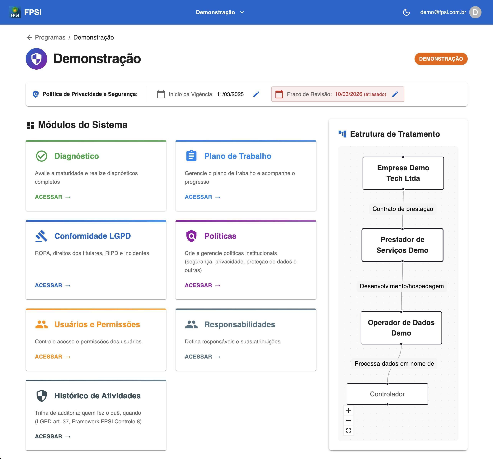
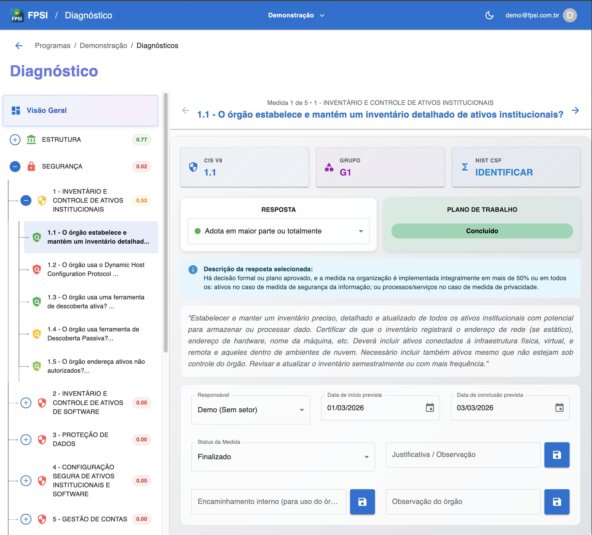
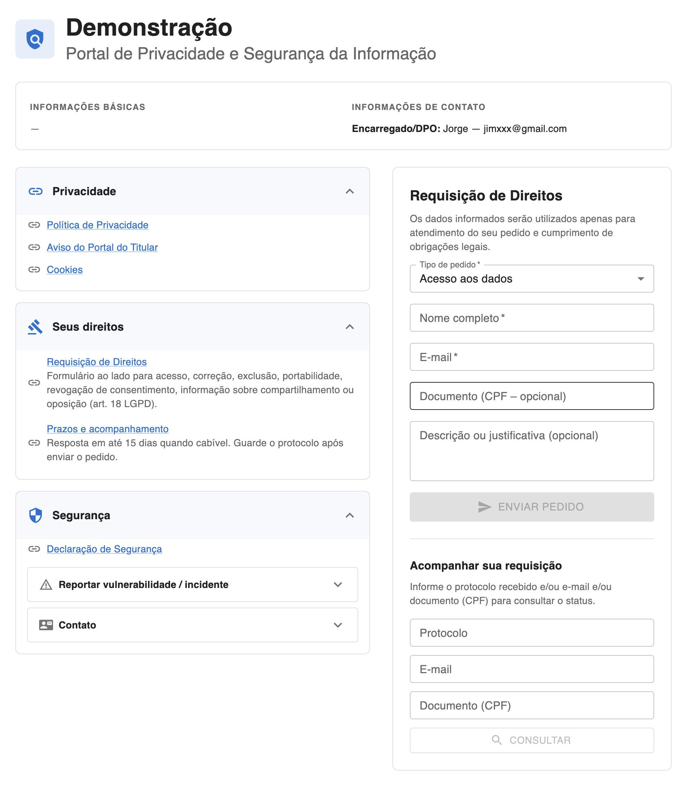

# Implementação open source do Framework de Privacidade e Segurança da Informação: ferramenta para compliance digital e governança de dados no setor público

**Open source implementation of the Privacy and Information Security Framework: a tool for digital compliance and data governance in the public sector**

---

## Resumo (português)

A intensificação da transformação digital e a entrada em vigor da Lei Geral de Proteção de Dados Pessoais (LGPD) impulsionaram a necessidade de ferramentas que auxiliem organizações a implementar programas de privacidade e segurança da informação. Em 2023, o Ministério da Gestão e da Inovação em Serviços Públicos estabeleceu o Programa de Privacidade e Segurança da Informação (PPSI) e o Framework de Privacidade e Segurança da Informação (FPSI), disponibilizando uma ferramenta oficial em planilha Excel para diagnóstico e acompanhamento de controles. Apesar da eficácia metodológica da ferramenta oficial, sua dependência de planilha eletrônica impõe limitações de acessibilidade, trabalho colaborativo e interoperabilidade. Este artigo apresenta uma implementação open source do Framework FPSI, desenvolvida com tecnologias web modernas (Next.js, React, Supabase), que visa suprir essas lacunas e oferecer uma alternativa gratuita e adaptável para órgãos públicos, empresas e consultores. O sistema implementa diagnóstico de maturidade, plano de trabalho, políticas, ROPA (Registro das Operações de Tratamento), portal de privacidade para titulares, pedidos dos titulares (art. 18 LGPD), trilha de auditoria e gestão de responsáveis, atendendo a necessidades centrais da rotina do DPO. A abertura do código permite colaboração da comunidade, adaptação à realidade de cada organização e oferta como PaaS (Privacy as a Service), reforçando o papel do software livre na promoção da privacidade e da segurança da informação.

**Palavras-chave:** LGPD; Framework PPSI; privacidade; segurança da informação; software livre; compliance digital; setor público.

---

## Abstract (English)

The intensification of digital transformation and the enactment of the Brazilian General Data Protection Law (LGPD) have driven the need for tools that help organizations implement privacy and information security programs. In 2023, the Ministry of Management and Innovation in Public Services established the Privacy and Information Security Program (PPSI) and the Privacy and Information Security Framework (FPSI), providing an official Excel spreadsheet tool for diagnosis and monitoring of controls. Despite the methodological effectiveness of the official tool, its dependence on spreadsheets imposes limitations on accessibility, collaborative work, and interoperability. This article presents an open source implementation of the FPSI Framework, developed with modern web technologies (Next.js, React, Supabase), which aims to address these gaps and offer a free and adaptable alternative for public agencies, companies, and consultants. The system implements maturity diagnosis, work plans, policies, ROPA (Record of Processing Activities), privacy portal for data subjects, data subject requests (Art. 18 LGPD), audit trail, and responsibility management, meeting core needs of the DPO routine. Opening the code allows community collaboration, adaptation to each organization's reality, and offering as PaaS (Privacy as a Service), reinforcing the role of free software in promoting privacy and information security.

**Keywords:** LGPD; PPSI Framework; privacy; information security; open source; digital compliance; public sector.

---

## INTRODUÇÃO

A intensificação da transformação digital nas últimas décadas alterou profundamente a forma como organizações públicas e privadas coletam, armazenam e tratam dados pessoais. A digitalização de serviços, a expansão de plataformas e sistemas de informação e a crescente dependência de dados para decisões estratégicas tornaram a proteção da privacidade e da segurança da informação um desafio central para governos de todo o mundo.

No Brasil, a entrada em vigor da Lei Geral de Proteção de Dados Pessoais (LGPD) em setembro de 2020 representou um marco regulatório fundamental para a adequação de organizações públicas e privadas às exigências de proteção de dados. Com inspiração no Regulamento Geral de Proteção de Dados (GDPR) da União Europeia, a LGPD estabelece obrigações que exigem mudanças estruturais nas organizações, incluindo a designação de Encarregado pelo Tratamento de Dados Pessoais (DPO), o mapeamento de operações de tratamento e a implementação de medidas técnicas e organizacionais adequadas ao risco.

Em 2023, o Ministério da Gestão e da Inovação em Serviços Públicos estabeleceu o Programa de Privacidade e Segurança da Informação (PPSI) e instituiu o Framework de Privacidade e Segurança da Informação (FPSI), disponibilizando uma ferramenta oficial em planilha Excel para diagnóstico e acompanhamento de controles. A ferramenta oferece um roteiro metodológico alinhado aos principais referenciais internacionais de segurança e privacidade, permitindo que órgãos públicos avaliem seu nível de maturidade e elaborem planos de ação.

Apesar da eficácia metodológica da ferramenta oficial na validação de medidas e no cálculo de níveis de maturidade, sua dependência de planilha eletrônica impõe limitações significativas em termos de acessibilidade, trabalho colaborativo e interoperabilidade. Em paralelo, as soluções comerciais de gestão de privacidade disponíveis no mercado são pagas e, em geral, não seguem o padrão do Framework PPSI nem permitem adaptação do código à realidade de cada organização.

Este artigo apresenta uma implementação open source do Framework FPSI, desenvolvida com tecnologias web modernas, que visa suprir essas lacunas e oferecer uma alternativa gratuita e adaptável para órgãos públicos, empresas e consultores. O trabalho está alinhado ao eixo temático de Privacidade e Proteção de Dados, abordando o impacto das legislações de proteção de dados (LGPD e correlatas), medidas de compliance digital e cultura organizacional voltada à privacidade.

O texto está organizado em oito seções. Após esta introdução, a seção 1 apresenta o marco regulatório (LGPD, PPSI e Framework FPSI), enquanto a seção 2 discute as limitações da ferramenta oficial e a demanda por alternativas. A seção 3 apresenta a proposta de implementação open source e a seção 4 detalha as funcionalidades e a arquitetura do sistema. Em seguida, a seção 5 aborda casos de uso e aplicação prática, a seção 6 trata de governança, auditoria e accountability, e a conclusão encerra o artigo.

---

## 1 Marco regulatório: LGPD, PPSI e o Framework FPSI

### 1.1 Lei Geral de Proteção de Dados Pessoais (LGPD)

A Lei Geral de Proteção de Dados Pessoais (Lei nº 13.709/2018), sancionada em agosto de 2018 e em vigor desde setembro de 2020, estabelece diretrizes para o tratamento de dados pessoais no Brasil. Inspirada no Regulamento Geral de Proteção de Dados (GDPR) da União Europeia, a LGPD impõe obrigações às organizações que coletam, armazenam, tratam e compartilham dados pessoais, incluindo a designação de Encarregado pelo Tratamento de Dados Pessoais (DPO), o registro das operações de tratamento (ROPA, art. 37) e a adoção de medidas de segurança técnicas e organizacionais adequadas ao risco.

A LGPD fundamenta-se em princípios como finalidade, adequação, necessidade, livre acesso, qualidade dos dados, transparência, segurança, prevenção, não discriminação e responsabilização e prestação de contas. O artigo 37 estabelece a obrigatoriedade de manutenção de registro das operações de tratamento de dados pessoais realizadas pelos controladores, que deve conter informações sobre a finalidade, a base legal, os titulares afetados, as categorias de dados, os compartilhamentos, as medidas de segurança e o prazo de retenção.

O DPO, previsto no artigo 41 da LGPD, atua como canal de comunicação entre o controlador, os titulares dos dados e a Autoridade Nacional de Proteção de Dados (ANPD). Entre suas atribuições estão aceitar reclamações e comunicações dos titulares, orientar colaboradores sobre práticas de proteção de dados, orientar sobre a realização de Avaliação de Impacto à Proteção de Dados Pessoais (RIPD) e elaborar o Relatório de Impacto quando aplicável. O DPO pode ser interno ou externo à organização, atuando como consultor em projetos de adequação.

### 1.2 Programa de Privacidade e Segurança da Informação (PPSI) e Framework FPSI

Em 30 de março de 2023, foi publicada pelo Ministério da Gestão e da Inovação em Serviços Públicos a portaria que estabelece o Programa de Privacidade e Segurança da Informação (PPSI) e institui o Framework de Privacidade e Segurança da Informação. O Framework, que já havia sido lançado em novembro de 2022, é baseado nos principais referenciais de privacidade e segurança, como CIS (Center for Internet Security), NIST (National Institute of Standards and Technology) e ISO/IEC, e oferece 31 controles de segurança e privacidade a serem implementados pelas repartições públicas.

O PPSI visa promover a governança em privacidade e segurança da informação no âmbito da administração pública federal, alinhando-se à Política Nacional de Segurança da Informação (PNSI) e à LGPD. O Framework estrutura-se em três diagnósticos: o Diagnóstico 1 (Controle 0) aborda a estruturação básica de gestão em privacidade e segurança; o Diagnóstico 2 cobre os Controles 1 a 18 de segurança da informação; e o Diagnóstico 3 abrange os Controles 19 a 31 de privacidade.

O documento disponibiliza ferramentas para auxiliar no diagnóstico e na melhoria do nível de segurança das organizações. Além de ser normativo para o setor público, a ANPD utiliza as diretrizes elaboradas para o setor público como referência, de modo que o setor privado também pode se beneficiar de processos de adequação ao Framework. Empresas que desejam demonstrar conformidade com boas práticas de privacidade e segurança encontram no Framework um roteiro estruturado e reconhecido.

### 1.3 Ferramenta oficial do Framework

A ferramenta oficial do Framework é distribuída no site do Governo Federal no formato de uma planilha Excel — *Ferramenta do Framework de Privacidade e Segurança da Informação*, atualmente na versão (ciclo) 2 — acompanhada de um manual de implementação. A pasta de trabalho contém as seguintes planilhas temáticas:

- **CADASTROS:** planilha de cadastro do órgão ou instituição, encarregados, gestores e responsáveis por departamento.
- **CONTROLE 0 — ESTRUTURAÇÃO BÁSICA DE GESTÃO:** questionário com medidas para o diagnóstico estrutural da gestão em privacidade e segurança da informação (papéis, políticas, comitês).
- **CONTROLES 1 A 18 — SEGURANÇA DA INFORMAÇÃO:** questionário com medidas, descrições, campo de respostas, justificativas, observações e nível de maturidade dos controles (gestão de ativos, controle de acesso, criptografia, logs de auditoria, entre outros).
- **CONTROLES 19 A 31 — PRIVACIDADE:** questionário com medidas de privacidade, descrições, respostas, justificativas e níveis de maturidade (direitos dos titulares, ROPA, políticas de privacidade, etc.).
- **RELATÓRIO DE TODOS OS CONTROLES:** quadro resumido com indicadores e nível de maturidade.
- **PLANO DE TRABALHO:** ações prioritárias baseadas nas respostas, responsáveis, departamentos, datas e status.

A interface utiliza fórmulas para calcular níveis de maturidade a partir das respostas às medidas e para gerar ações prioritárias no plano de trabalho. O cálculo considera o Índice de Nível de Capacidade do Controle (INCC), que avalia qualitativamente a efetividade de cada controle, e as pontuações das medidas de implementação. A ferramenta se mostrou eficiente em simplificar a validação das medidas e medir o nível de maturidade de um programa.

---

## 2 Limitações da ferramenta oficial e demanda por alternativas

Apesar da eficiência na avaliação dos controles, a ferramenta oficial apresenta limitações decorrentes da tecnologia utilizada (planilha no formato Excel). Tais limitações afetam especialmente órgãos públicos de maior porte, consultorias que atendem múltiplos clientes e organizações que priorizam trabalho colaborativo e software livre.

**Acessibilidade:** a interface de planilha possui restrições para usuários com necessidades especiais. Leitores de tela e tecnologias assistivas têm dificuldade em interpretar a estrutura de células, fórmulas e elementos gráficos típicos do Excel. A navegação por teclado é limitada em comparação com aplicações web modernas desenvolvidas com padrões de acessibilidade (WCAG). Em um contexto em que a administração pública deve garantir acessibilidade conforme a Lei Brasileira de Inclusão (Lei nº 13.146/2015), a dependência de planilha representa uma barreira.

**Trabalho distribuído:** os dados ficam armazenados em um arquivo no computador de um usuário, dificultando o trabalho colaborativo entre vários usuários (DPO, gestores, analistas de diferentes departamentos). A manutenção de uma versão única e atualizada exige procedimentos manuais de consolidação, com risco de conflitos e perda de alterações. Em projetos de adequação que envolvem múltiplos responsáveis, a centralização em um único arquivo local torna o processo lento e propenso a erros.

**Disponibilidade:** há dependência de um único arquivo local, com risco de perda por falha de hardware, exclusão acidental ou corrupção. O backup centralizado e versionamento são difíceis de implementar de forma integrada. Em cenários de trabalho remoto ou híbrido, o compartilhamento do arquivo por e-mail ou drives aumenta o risco de proliferar versões desatualizadas.

**Software proprietário:** a edição com total compatibilidade depende de Microsoft Office. Órgãos que adotam software livre (como LibreOffice) podem enfrentar incompatibilidades em fórmulas, formatação ou macros. O custo de licenciamento para múltiplos usuários pode ser significativo para pequenas organizações ou consultorias.

As principais soluções comerciais existentes para a gestão de um programa de governança em privacidade são pagas, sem alternativas gratuitas para implementação em órgãos públicos ou pequenas empresas. Além disso, as soluções existentes não seguem o padrão de conformidade do Framework do PPSI nem permitem modificação no código, a fim de adaptar a metodologia à realidade de uma organização. Diante desse cenário, surge a demanda por uma ferramenta que combine o roteiro metodológico do Framework com as vantagens de uma aplicação web colaborativa e open source.

---

## 3 Proposta: implementação open source

Propõe-se desenvolver uma implementação da Ferramenta do Framework do PPSI utilizando tecnologias modernas, escaláveis e de fácil absorção pelo mercado, como React, Node.js e plataformas de armazenamento como Supabase, com o objetivo de fornecer um software de referência em privacidade e segurança da informação no modelo de distribuição open source.

A escolha por tecnologias web (em oposição a aplicações desktop) justifica-se pela necessidade de trabalho colaborativo, acesso de qualquer dispositivo e independência de sistema operacional. React e Next.js são amplamente adotados no mercado, com grande comunidade e documentação, o que facilita a manutenção e a evolução do projeto. O Supabase oferece autenticação, banco de dados PostgreSQL e APIs REST em um modelo que permite implantação em nuvem ou on-premises, adequando-se a diferentes contextos de uso.

A justificativa da abertura do código inclui:

- **Colaboração da comunidade:** permitir que a comunidade contribua com novas versões do framework e com melhorias na ferramenta. À medida que o Framework PPSI evolui (novos ciclos, ajustes metodológicos), a ferramenta pode ser atualizada de forma colaborativa, com revisão por pares e transparência no processo de desenvolvimento.

- **Implantação ampla:** facilitar a implantação do framework em órgãos públicos, empresas e consultores independentes, sem custo de licença. Órgãos com restrições orçamentárias ou políticas de adoção de software livre podem utilizar a ferramenta sem barreiras econômicas ou legais.

- **PaaS (Privacy as a Service):** permitir que plataformas ofereçam o serviço hospedado, mantendo a possibilidade de auditoria do código. Consultorias e provedores de serviços podem hospedar a aplicação para seus clientes, agregando valor sem depender de software proprietário fechado.

- **Adaptabilidade:** garantir que organizações possam adaptar o código à sua realidade, customizando fluxos, campos ou integrações. Órgãos com necessidades específicas (por exemplo, integração com sistemas de gestão documental ou relatórios customizados) podem estender a ferramenta sem violar licenças restritivas.

---

## 4 Funcionalidades e arquitetura do sistema

### 4.1 Módulos principais

*Figura 1. Painel do programa com módulos do sistema e estrutura de tratamento (controlador, operador).*

A implementação open source cobre os seguintes módulos, alinhados ao Framework oficial:

**Diagnóstico de maturidade:** estrutura em árvore (diagnóstico → controle → medida); respostas e justificativas por medida; níveis INCC (Índice de Nível de Capacidade do Controle) de 0 a 5; dashboard de maturidade com indicadores visuais (gráficos, cores por nível); 31 controles alinhados ao Framework oficial (Controle 0 de estruturação básica, Controles 1–18 de segurança, Controles 19–31 de privacidade). O cálculo de maturidade implementa a fórmula oficial: iMC = (∑PMC / (QMC - QMNAC)) / 2 × (1 + iNCC/100), onde PMC é a pontuação das medidas, QMC a quantidade de medidas, QMNAC a quantidade de medidas não aplicáveis e iNCC o índice de capacidade. A classificação em níveis (Inicial, Básico, Intermediário, Em Aprimoramento, Aprimorado) segue as faixas definidas no guia oficial.

*Figura 2. Módulo de diagnóstico: árvore de controles e detalhamento de medida com resposta e plano de trabalho.*

**Plano de trabalho:** ações prioritárias derivadas das respostas do diagnóstico; atribuição de responsáveis, datas de início e fim, status (pendente, em andamento, concluído); campos para orçamento e riscos; dashboard executivo para acompanhamento do progresso; vinculação entre ações e controles/medidas do diagnóstico.

**Políticas:** editor de políticas institucionais com interface rica (WYSIWYG), incluindo política de proteção de dados pessoais (LGPD); modelos pré-configurados baseados em boas práticas; exportação em PDF para divulgação e arquivamento; versionamento de alterações.

**ROPA (Registro das Operações de Tratamento):** módulo para registro das operações conforme art. 37 da LGPD; campos para nome do processo, finalidade, base legal, categorias de dados, titulares, compartilhamento, retenção e medidas de segurança; listagem com filtros; exportação para relatórios e auditorias.

**Portal de privacidade:** página pública por programa (URL customizável por slug), onde titulares exercem direitos previstos no art. 18 da LGPD — acesso, correção, exclusão, portabilidade, revogação de consentimento, informação sobre compartilhamento e oposição — além de reportar vulnerabilidades ou incidentes e enviar mensagens de contato. Cada programa possui seu próprio portal; o DPO obtém o link para distribuir aos titulares.

*Figura 3. Portal de privacidade para titulares: requisição de direitos (art. 18 LGPD) e acompanhamento de pedidos.*

**Pedidos dos titulares:** módulo para registro e acompanhamento de pedidos recebidos pelo portal; fluxo de atendimento com prazos e status; procedimentos alinhados ao art. 18 da LGPD; exportação em PDF para documentação e auditoria.

**Responsáveis:** cadastro de responsáveis por controles e departamentos; atribuição de papéis (admin, coordenador, analista, consultor, auditor) com permissões diferenciadas; gestão de convites por e-mail; associação de usuários a múltiplos programas (para consultores que atendem vários clientes).

**Auditoria:** trilha de auditoria que registra quem fez o quê e quando (criação, alteração e exclusão de recursos); alinhada ao Controle 8 do Framework (gestão de log de auditoria) e às exigências de rastreabilidade do art. 37 da LGPD; filtros por usuário, ação, recurso e período; exibição na interface do programa.

### 4.2 Arquitetura técnica

- **Frontend:** Next.js 15, React 19, TypeScript, Material-UI (MUI). A aplicação utiliza Server Components onde apropriado e Client Components para interatividade. O roteamento baseado em arquivos facilita a organização do código e a navegação.

- **Backend:** Supabase (autenticação por e-mail/senha e OAuth, banco de dados PostgreSQL, APIs REST, Row Level Security para isolamento de dados). A escolha pelo Supabase permite implantação rápida e escalável, com a possibilidade de migração para PostgreSQL self-hosted se necessário.

- **Cálculo de maturidade:** implementação em TypeScript das fórmulas oficiais (iMC, iSeg, iPriv), com tratamento correto de medidas "Não se aplica" (excluídas do denominador) e níveis de capacidade (INCC). A lógica está documentada e testada para garantir conformidade com o Framework.

### 4.3 Multi-cliente

O conceito de "programa" permite que um consultor gerencie vários clientes na mesma ferramenta, com isolamento de dados por programa e permissões configuráveis por usuário. Cada programa possui seu próprio diagnóstico, plano de trabalho, ROPA e políticas, permitindo que o DPO em consultoria acompanhe a evolução de múltiplas organizações sem misturar informações.

---

## 5 Casos de uso e aplicação prática

### 5.1 Projeto PINOVARA

O FPSI é utilizado no projeto PINOVARA (Pesquisa Inovadora em Gestão do PNRA), parceria entre o INCRA e a UFBA via Termo de Execução Descentralizado (TED nº 50/2023). O projeto envolve o desenvolvimento de processos inovadores no georreferenciamento e supervisão ocupacional, com coleta de dados socioeconômicos e ambientais em assentamentos federais e territórios quilombolas nos estados da Bahia, São Paulo e Espírito Santo, impactando mais de 5.000 famílias.

O escopo atual em operação inclui o cadastro de capacitações e participantes (Meta 11) e o cadastro de organizações e representantes (Meta 12). O escopo futuro prevê o cadastro de famílias em territórios, com coleta em campo via tablets, dados pessoais de famílias inteiras e fotos de documentos e propriedades para elaboração de RTID (Relatório Técnico de Identificação). O tratamento de dados sensíveis em territórios quilombolas (origem racial/étnica) exigirá RIPD e atualização da política de privacidade antes do início das atividades.

O sistema apoia o programa de privacidade do PINOVARA, com definição clara de papéis (controlador: UFBA/INCRA; operador: empresa de desenvolvimento/hospedagem), documentação das operações de tratamento no ROPA e adequação à LGPD em contexto de política pública. O uso do FPSI no projeto demonstra a aplicabilidade da ferramenta em cenários complexos de coleta de dados em campo e múltiplos titulares.

### 5.2 Rotina do DPO em consultoria

O sistema cobre etapas centrais da rotina do DPO em consultoria: levantamento e governança (cadastro de responsáveis, definição de políticas), diagnóstico de maturidade (aplicação do framework PPSI com os 31 controles), plano de trabalho (priorização de ações, atribuição de prazos e responsáveis, acompanhamento de status) e implementação e acompanhamento (evolução do diagnóstico ao longo do tempo).

O hub de Conformidade LGPD concentra ROPA, pedidos dos titulares, RIPD e incidentes, além de reportes e contato recebidos pelo portal de privacidade. O portal público permite que titulares exerçam direitos (art. 18 LGPD) e que cidadãos reportem vulnerabilidades ou enviem mensagens, enquanto o DPO gerencia os pedidos e acompanha prazos no módulo interno. Itens como RIPD e gestão de incidentes estão implementados ou em desenvolvimento, permitindo que o DPO utilize o FPSI como núcleo do diagnóstico e do plano alinhados ao PPSI. A documentação do projeto (ROTINA_DPO_E_GAPS) detalha a cobertura atual e os gaps identificados para uma gestão de privacidade completa.

---

## 6 Considerações sobre governança, auditoria e accountability

O sistema implementa trilha de auditoria (logs de atividades) que registra ações dos usuários no programa — criação, alteração e exclusão de recursos como controles, medidas, planos de ação e políticas — em conformidade com o Controle 8 do Framework (gestão de log de auditoria) e com exigências de rastreabilidade do art. 37 da LGPD. A trilha permite responder a perguntas como "quem alterou este controle?", "quando foi feita a última modificação?" e "quais alterações foram realizadas em um período?", essenciais para accountability e para auditorias internas ou externas.

A abertura do código permite auditoria independente da implementação: qualquer organização ou pesquisador pode verificar se as fórmulas de maturidade estão corretas, se os dados são tratados adequadamente e se não há vulnerabilidades ocultas. Isso contribui para a transparência e a accountability na governança de dados, alinhando-se aos princípios de privacy by design e de demonstração de conformidade. Em um contexto em que órgãos de controle (como TCU e CGU) exigem evidências de adequação à LGPD e ao Framework PPSI, a possibilidade de auditar tanto os processos quanto a ferramenta que os suporta reforça a confiabilidade da solução.

---

## Conclusão

A implementação open source do Framework FPSI oferece uma alternativa à ferramenta oficial em Excel, combinando o roteiro metodológico do PPSI com trabalho colaborativo, independência de software proprietário e adaptabilidade. O sistema já cobre diagnóstico de maturidade, plano de trabalho, políticas, ROPA, portal de privacidade, pedidos dos titulares e trilha de auditoria, atendendo a necessidades centrais de DPOs e gestores de segurança no setor público e privado.

A abertura do código permite que a comunidade contribua com melhorias e que organizações adaptem a ferramenta às suas realidades, reforçando o papel do software livre na promoção da privacidade e da segurança da informação. Em um cenário de intensificação da transformação digital e de exigências crescentes de compliance, ferramentas gratuitas e auditáveis como o FPSI contribuem para a democratização do acesso à adequação à LGPD e ao Framework PPSI.

Perspectivas de trabalho futuro incluem a ampliação dos módulos de gestão de direitos dos titulares, RIPD e gestão de incidentes, bem como a integração com sistemas de gestão documental e relatórios padronizados para órgãos de controle. A evolução do Framework oficial (novos ciclos) exigirá acompanhamento contínuo para manter a conformidade da implementação.

---

## Referências

BRASIL. Lei nº 13.709, de 14 de agosto de 2018. Lei Geral de Proteção de Dados Pessoais (LGPD). *Diário Oficial da União*, Brasília, 15 ago. 2018.

BRASIL. Lei nº 13.146, de 6 de julho de 2015. Lei Brasileira de Inclusão da Pessoa com Deficiência. *Diário Oficial da União*, Brasília, 7 jul. 2015.

BRASIL. Ministério da Gestão e da Inovação em Serviços Públicos. Portaria que estabelece o Programa de Privacidade e Segurança da Informação (PPSI) e institui o Framework de Privacidade e Segurança da Informação. 30 mar. 2023.

GOVERNO FEDERAL. Ferramenta do Framework de Privacidade e Segurança da Informação (planilha Excel, ciclo 2). Disponível em: site oficial do Governo Federal.

ANPD — Autoridade Nacional de Proteção de Dados. Disponível em: www.gov.br/anpd.

Documentação do projeto FPSI. Disponível em: repositório do projeto (docs/essentials/CONTEXTO_PESQUISA_ORIGEM.md, docs/essentials/ROTINA_DPO_E_GAPS.md, docs/pinovara/PROGRAMA_PRIVACIDADE.md).
