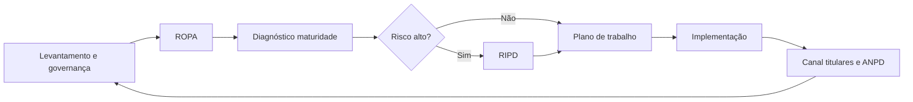

# Rotina do DPO e gaps do FPSI

Este documento explica a rotina e os passos do DPO (com foco em consultoria), como o FPSI já apoia esse trabalho e o que falta implementar para uma experiência completa de gestão de privacidade. Serve como guia de estudo para quem está se especializando na área e como backlog de produto.

---

## 1. Papel do DPO (LGPD, art. 41)

O Encarregado pelo Tratamento de Dados Pessoais (DPO) é o canal de comunicação entre o controlador, os titulares dos dados e a Autoridade Nacional de Proteção de Dados (ANPD). Entre suas atribuições:

- Aceitar reclamações e comunicações dos titulares, prestar esclarecimentos e adotar providências.
- Orientar os colaboradores e os contratados da organização sobre as práticas de proteção de dados.
- Orientar, a pedido do controlador, sobre a realização de Avaliação de Impacto à Proteção de Dados Pessoais (RIPD/AIPD).
- Elaborar o Relatório de Impacto à Proteção de Dados Pessoais quando aplicável.

O DPO pode ser interno ou externo (consultor). Em consultoria, ele entra em um cliente (empresa, órgão ou projeto) para estruturar ou adequar o programa de privacidade.

---

## 2. Rotina e passos do DPO em consultoria

Passos típicos que um DPO/consultor segue ao atuar em um cliente:

1. **Levantamento e governança**  
   Entender a estrutura da organização, processos e fluxos de dados; definir ou completar a governança (políticas, comitê, responsáveis).

2. **Mapeamento de dados (ROPA)**  
   Registrar as operações de tratamento de dados pessoais (art. 37 da LGPD): finalidade, base legal, categorias de dados, compartilhamentos, prazo de retenção, medidas de segurança.

3. **Diagnóstico de maturidade**  
   Avaliar os controles de privacidade e segurança (por exemplo com o framework PPSI/FPSI) e o nível de implementação atual.

4. **Riscos e RIPD**  
   Identificar tratamentos de alto risco e elaborar o Relatório de Impacto à Proteção de Dados Pessoais (RIPD/AIPD) quando necessário.

5. **Plano de ação/trabalho**  
   Priorizar ações: conformidade, políticas, treinamento, processos de direitos dos titulares, resposta a incidentes.

6. **Implementação e acompanhamento**  
   Colocar em prática políticas, treinamentos e processos operacionais; acompanhar o plano e a evolução da maturidade.

7. **Canal com titulares e ANPD**  
   Receber e tratar pedidos dos titulares (acesso, correção, exclusão, portabilidade, oposição, revogação de consentimento); reportar à ANPD quando exigido (por exemplo incidentes graves).

Fluxo resumido:

---

## 3. Onde o FPSI já ajuda o DPO

| Passo do DPO | Suporte no FPSI |
|--------------|-----------------|
| Levantamento e governança | Cadastro de responsáveis por controle; múltiplos usuários e perfis; políticas de segurança (modelos, editor, PDF, incluindo política de proteção de dados/LGPD). |
| Diagnóstico de maturidade | Módulo Diagnóstico: árvore diagnóstico → controle → medida; respostas e justificativas; níveis INCC (0–5); dashboard de maturidade; 31 controles (estruturação básica, segurança 1–18, privacidade 19–31). |
| Plano de ação/trabalho | Módulo Plano de Trabalho: ações, responsáveis, datas, status, orçamento, riscos; dashboard executivo. |
| Implementação e acompanhamento | Políticas editáveis e exportação em PDF; responsáveis atribuídos aos controles; acompanhamento do plano por status e prazos. |
| Multi-cliente (consultoria) | Um “programa” por cliente/projeto; o consultor pode gerenciar vários programas (clientes) na mesma ferramenta. |

Resumo: o FPSI cobre bem o **diagnóstico de maturidade** (framework PPSI), o **plano de trabalho**, as **políticas** e a **gestão de responsáveis**, além de permitir trabalho em equipe e múltiplos clientes.

---

## 4. O que falta para uma experiência completa

Itens que um DPO costuma precisar e que o FPSI ainda não cobre (ou cobre só em parte), com prioridade sugerida.

### Prioridade alta

| Item | O que é / por que importa | Sugestão de implementação |
|------|---------------------------|----------------------------|
| **ROPA (Registro das Operações de Tratamento)** | Obrigação do art. 37 da LGPD. Registro de cada operação de tratamento: finalidade, base legal, categorias de dados, compartilhamento, retenção, medidas de segurança. Central para o dia a dia do DPO. | Módulo “Operações de Tratamento” ou “ROPA”: cadastro de operações por programa, com campos alinhados ao art. 37; listagem, filtros e exportação (PDF/Excel). |
| **Gestão de direitos dos titulares** | LGPD art. 18: titulares têm direito a acesso, correção, exclusão, portabilidade, oposição, revogação do consentimento etc. O DPO precisa de um canal e de prazos para atendimento. | Módulo “Pedidos dos titulares”: registro de pedidos (tipo, titular, data, prazo, status, resposta); fluxo de atendimento e alertas de prazo. |
| **RIPD/AIPD (Relatório de Impacto)** | Relatório de Impacto à Proteção de Dados Pessoais para tratamentos de alto risco (LGPD). O DPO orienta ou elabora. | Cadastro/modelo de RIPD por operação ou por programa; vinculação com ROPA e com itens do plano de trabalho. |
| **Gestão de incidentes** | Incidentes de segurança que afetam dados pessoais devem ser tratados e, quando aplicável, comunicados à ANPD e aos titulares, com prazos e evidências. | Módulo “Incidentes”: registro de incidentes (descrição, severidade, dados afetados, comunicação ANPD/titulares, status); prazos e checklist de comunicação. |

### Prioridade média

| Item | O que é / por que importa | Sugestão de implementação |
|------|---------------------------|----------------------------|
| **Workflow de aprovação** | Em órgãos públicos (e em alguns clientes), diagnósticos e planos precisam ser aprovados por gestores antes de serem considerados oficiais. | Fluxo de aprovação para conclusões do diagnóstico e/ou do plano de trabalho; histórico de aprovações e justificativas. |
| **Relatórios executivos e exportação** | O consultor precisa apresentar ao cliente ou à alta administração um resumo do diagnóstico e do plano (PDF/Excel). | Relatório de conformidade (resumo do diagnóstico + plano); exportação em PDF/Excel para apresentação. |
| **Base de conhecimento / treinamento** | Materiais de conscientização, links para LGPD/ANPD e orientações por controle ajudam o DPO e o cliente. | Área de documentos/links (LGPD, ANPD, guias); orientações por controle ou por diagnóstico; espaço para materiais de treinamento. |

### Prioridade baixa

| Item | O que é / por que importa | Sugestão de implementação |
|------|---------------------------|----------------------------|
| **Múltiplos clientes/contratos** | O conceito de “programa” já permite um programa por cliente. Refinamentos podem facilitar a organização. | Etiquetas ou filtros por cliente/contrato; campos opcionais de vigência de contrato ou escopo. |

---

## 5. Conclusão

A ferramenta FPSI **já cobre bem** o diagnóstico de maturidade (framework PPSI), o plano de trabalho, as políticas e os responsáveis. Para quem usa o framework PPSI — órgãos públicos, empresas e consultores que adotam o framework —, ela oferece roteiro de diagnóstico, maturidade e plano em um só lugar, multi-usuário e sem planilha.

Para uma **gestão de privacidade completa** (atuar como DPO de ponta a ponta), os próximos passos mais impactantes são: **ROPA**, **gestão de direitos dos titulares**, **RIPD** e **gestão de incidentes**. Enquanto esses módulos não existirem no FPSI, o DPO pode complementar com outros processos ou ferramentas específicas (planilhas, sistemas de tickets, etc.) e usar o FPSI como núcleo do diagnóstico e do plano alinhados ao PPSI.
