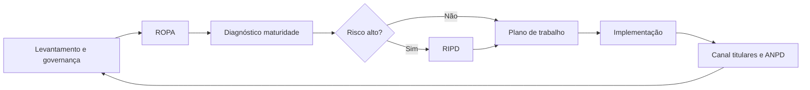

# Rotina do DPO e gaps do FPSI

Este documento explica a rotina e os passos do DPO (com foco em consultoria), como o FPSI já apoia esse trabalho e o que falta implementar para uma experiência completa de gestão de privacidade. Serve como guia de estudo para quem está se especializando na área e como backlog de produto.

---

## 1. Papel do DPO (LGPD, art. 41)

O Encarregado pelo Tratamento de Dados Pessoais (DPO) é o canal de comunicação entre o controlador, os titulares dos dados e a Autoridade Nacional de Proteção de Dados (ANPD). Entre suas atribuições:

- Aceitar reclamações e comunicações dos titulares, prestar esclarecimentos e adotar providências.
- Orientar os colaboradores e os contratados da organização sobre as práticas de proteção de dados.
- Orientar, a pedido do controlador, sobre a realização de Avaliação de Impacto à Proteção de Dados Pessoais (RIPD/AIPD).
- Elaborar o Relatório de Impacto à Proteção de Dados Pessoais quando aplicável.

O DPO pode ser interno ou externo (consultor). Em consultoria, ele entra em um cliente (empresa, órgão ou projeto) para estruturar ou adequar o programa de privacidade.

---

## 2. Rotina e passos do DPO em consultoria

Passos típicos que um DPO/consultor segue ao atuar em um cliente:

1. **Levantamento e governança**  
   Entender a estrutura da organização, processos e fluxos de dados; definir ou completar a governança (políticas, comitê, responsáveis).

2. **Mapeamento de dados (ROPA)**  
   Registrar as operações de tratamento de dados pessoais (art. 37 da LGPD): finalidade, base legal, categorias de dados, compartilhamentos, prazo de retenção, medidas de segurança.

3. **Diagnóstico de maturidade**  
   Avaliar os controles de privacidade e segurança (por exemplo com o framework PPSI/FPSI) e o nível de implementação atual.

4. **Riscos e RIPD**  
   Identificar tratamentos de alto risco e elaborar o Relatório de Impacto à Proteção de Dados Pessoais (RIPD/AIPD) quando necessário.

5. **Plano de ação/trabalho**  
   Priorizar ações: conformidade, políticas, treinamento, processos de direitos dos titulares, resposta a incidentes.

6. **Implementação e acompanhamento**  
   Colocar em prática políticas, treinamentos e processos operacionais; acompanhar o plano e a evolução da maturidade.

7. **Canal com titulares e ANPD**  
   Receber e tratar pedidos dos titulares (acesso, correção, exclusão, portabilidade, oposição, revogação de consentimento); reportar à ANPD quando exigido (por exemplo incidentes graves).

Fluxo resumido:

```mermaid
flowchart LR
  A[Levantamento e governança] --> B[ROPA]
  B --> C[Diagnóstico maturidade]
  C --> D{Risco alto?}
  D -->|Sim| E[RIPD]
  D -->|Não| F[Plano de trabalho]
  E --> F
  F --> G[Implementação]
  G --> H[Canal titulares e ANPD]
  H --> A
```

---

## 3. Onde o FPSI já ajuda o DPO

| Passo do DPO | Suporte no FPSI |
|--------------|-----------------|
| Levantamento e governança | Cadastro de responsáveis por controle; múltiplos usuários e perfis; políticas de segurança (modelos, editor, PDF, incluindo política de proteção de dados/LGPD). |
| Diagnóstico de maturidade | Módulo Diagnóstico: árvore diagnóstico → controle → medida; respostas e justificativas; níveis INCC (0–5); dashboard de maturidade; 31 controles (estruturação básica, segurança 1–18, privacidade 19–31). |
| Plano de ação/trabalho | Módulo Plano de Trabalho: ações, responsáveis, datas, status, orçamento, riscos; dashboard executivo. |
| Implementação e acompanhamento | Políticas editáveis e exportação em PDF; responsáveis atribuídos aos controles; acompanhamento do plano por status e prazos. |
| Multi-cliente (consultoria) | Um “programa” por cliente/projeto; o consultor pode gerenciar vários programas (clientes) na mesma ferramenta. |

Resumo: o FPSI cobre bem o **diagnóstico de maturidade** (framework PPSI), o **plano de trabalho**, as **políticas** e a **gestão de responsáveis**, além de permitir trabalho em equipe e múltiplos clientes.

---

## 4. O que o FPSI já cobre na rotina do DPO (atualizado)

Já existem no produto (não tratar como gap): ROPA / mapeamento, RIPD, incidentes, canal e pedidos de titulares, políticas, diagnóstico PPSI, plano de trabalho, evidências, mapa de fornecedores, governança avançada (decisões + portal do auditor) e kits de cultura.

### Ainda fora do escopo (consultoria)

| Item | Situação |
|------|----------|
| Timesheet / faturamento | Fora de propósito — o cockpit cobre prazos, não horas cobráveis |
| LMS com certificado por colaborador | Kits imprimíveis em `/cultura`; registro de treino ainda é evidência manual |
| Busca com IA em processos/mapeamento | Backlog (TO-DO) |

---

## 5. Conclusão

O FPSI cobre o ciclo do DPO consultor: um **programa = um cliente**, com diagnóstico, ROPA, RIPD, incidentes, canal do titular, políticas, fornecedores e evidências. O dashboard agrega pendências de todos os programas; o quadro em Plano de trabalho organiza as ações. Não substitui CRM nem certificação ISO — organiza o trabalho e a prova de conformidade.
