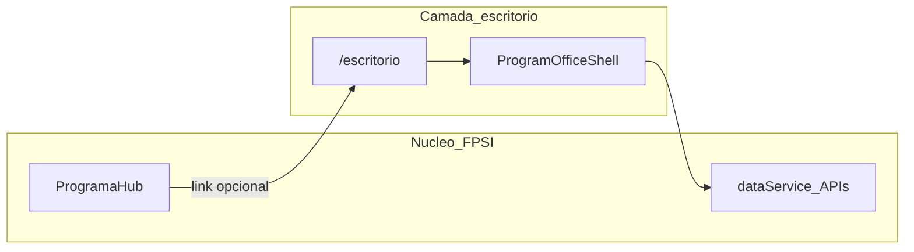

# Escritório de governança (camada visual / “RPG” PPSI 2.0)

Interface alternativa ao painel do programa: metáfora de **escritório 2D** (salas, mesas, corredor) que **não substitui** as telas existentes — apenas oferece outra **casca de navegação** e, no futuro, conteúdo educativo (diálogos alinhados à LGPD e à cartilha PPSI 2.0). Módulos reais (ROPA, diagnóstico, responsáveis, etc.) continuam nas mesmas rotas.

---

## 1. Objetivos

- **Pedagógico:** orientar fluxos (governança → tratamento → maturidade → plano → políticas) com linguagem acessível e referências normativas.
- **Operacional:** concentrar atalhos e “indicadores de presença” dos papéis e comitês sem duplicar regras de negócio no front do jogo.
- **Produto:** experiência opcional; quem preferir usa só o painel em cards tradicional.

---

## 2. O que não é

- Substituição do dashboard atual (`/programas/[id]`).
- Motor de jogo acoplado ao núcleo do FPSI: **nenhum serviço, hook ou API compartilhada obrigatória** deve importar módulos desta camada.
- Microserviço ou repositório fora do projeto: tudo vive **dentro** deste app Next.js.

---

## 3. Isolamento de código (acordo de dependências)

**Objetivo:** localizar tudo num único lugar e evitar que o **core** passe a depender da camada de escritório.

| Direção | Permitido |
|--------|------------|
| **Escritório → sistema** | Sim: usa `dataService`, hooks existentes, rotas já definidas, componentes comuns (`PageHeroHeader`, etc.). |
| **Sistema → escritório** | Apenas **pontos de entrada finos**: por exemplo rota `programas/[id]/escritorio` e um **único** card no hub que linka para essa rota. O hub não importa telas internas do escritório — só um link. |

**Organização física:** código da experiência concentrado em **[`src/features/program-office/`](../../../src/features/program-office/README.md)** (componentes, rotas internas da feature, textos de UI específicos). A rota Next.js em `src/app/programas/[id]/escritorio/page.tsx` deve permanecer **enxuta**: monta layout e delega à feature.

**Remoção futura:** apagar pasta `src/features/program-office`, rota `escritorio` e o card/link no hub restaura o estado anterior sem caçar imports espalhados no núcleo.

---

## 4. Fundamentação PPSI 2.0 e papéis obrigatórios

Os cinco papéis estruturantes da governança (segmento base, controle de estruturação básica) são os da mesa central. Referência interna: guia em `docs/ppsi/` e materiais em `docs/pinovara/PROGRAMA_PRIVACIDADE.md`.

| Papel (nome de produto) | Campo em `programa` (FK → `responsavel`) |
|-------------------------|----------------------------------------|
| Representante da alta administração | `representante_alta_administracao` |
| Responsável pela gestão da integridade | `responsavel_gestao_integridade` |
| Gestor de segurança da informação | `gestor_seguranca_informacao` |
| Encarregado (dados pessoais) | `encarregado_dados_pessoais` |
| Gestor de TIC | `gestor_tic` |

Quando um FK estiver **nulo**, o avatar correspondente deve aparecer **genérico / acinzentado**, com indicação de que o papel precisa ser designado; a ação leva ao fluxo já existente de **Estrutura de Governança** / cadastro de responsáveis (sem criar dependência inversa: o cadastro não “sabe” do escritório).

---

## 5. Comitês e ETIR

| Metáfora | Origem de dados |
|----------|-----------------|
| Mesa Comitê de SI | `programa_grupo_governanca` com `tipo = 'comite_seguranca_informacao'` + membros |
| Mesa Comitê de proteção de dados | `tipo = 'comite_protecao_dados'` |
| Mesa ETIR | `tipo = 'etir'` |

Convites e membros seguem as mesmas regras já implementadas para grupos de governança.

---

## 6. Salas por departamento

Agrupar **responsáveis** (e, quando aplicável, usuários do programa) por **departamento** (`responsavel.departamento` ou vínculos existentes no cadastro). Cada valor distinto → uma “sala” genérica com identificação do departamento; personagens listados são os **mesmos** registros do sistema.

---

## 7. Sala principal (layout alvo)

### 7.1 Mesa central (reunião)

Mesa comprida estilo sala de reunião:

- Na **cabeceira**: Representante da alta administração (metáfora visual do “chefe”).
- Demais papéis ao longo da mesa conforme convenção de UX (ordem fixa na UI para consistência).

**Folhas de papel** na mesa (atalhos para as mesmas áreas do painel):

| Folha | Destino (rota relativa ao programa) |
|-------|-------------------------------------|
| Níveis de maturidade | `diagnostico` |
| Plano de trabalho | `planos-acao` |
| Tratamento de dados e riscos (ROPA, RIPD, incidentes) | `conformidade` |
| Políticas | `politicas` |

### 7.2 Outras mesas (cantos)

Três mesas: CSI, comitê de privacidade, ETIR — cada uma reflete o grupo correspondente e lista membros / atalhos para gestão quando existir na UI atual.

### 7.3 Quadros na parede

| Quadro | Função |
|--------|--------|
| Diagrama / Estrutura de Tratamento | Atalho para governança + diagrama LGPD (`responsabilidades`) |
| Níveis de maturidade | Atalho para `diagnostico` |
| Tratamento de dados e riscos | Números agregados (ROPA, RIPD, incidentes) + link `conformidade` |

Os números devem reutilizar os mesmos endpoints ou hooks já usados pelo dashboard e pelo card “Tratamento de dados e riscos”, evitando segunda fonte da verdade.

---

## 8. Ações e gameplay (evolução)

**Curto prazo:** navegação por áreas (clique em mesa, quadro, folha → `router.push` para rotas existentes).

**Médio prazo:** corredor entre salas; interações “perguntar / recomendar” como UX social (integração com requisições ou mensagens, se o produto já tiver).

**Longo prazo:** diálogos educativos contextualizados; personalização de avatar (fora do escopo inicial — mesmo sprite para todos no MVP).

---

## 9. Implementação — estado atual e próximos passos

| Fase | Conteúdo |
|------|----------|
| **Feito** | Modo **Jogo**: parede e quadros; piso com luz e vinheta; mesa com bonecos e folhas; CSI/ETIR/privacidade; **corredor com portas** (`GameCorridorStrip`); **HUD** com dicas PPSI + atalhos (`GameHudBar`, `gameHints`). **Jogo/Lista** em `localStorage`. **Lista** = cartões. |
| **Seguinte** | Sprites / tilemap; animação de “caminhar” entre salas; diálogos com trechos da cartilha. |
| **Depois** | Personalização de personagem; interações sociais (pedidos/recomendações). |

Componentes principais: `ProgramOfficeShell.tsx`, `game/OfficeGameScene.tsx`, `game/GameCorridorStrip.tsx`, `game/GameHudBar.tsx`, `game/gameHints.ts`, `game/GameHotspot.tsx`, `game/gameTheme.ts`, `OfficeMesaCentral.tsx`, `OfficeQuadrosParede.tsx`, `OfficeFolhasMesa.tsx`, `OfficeComitesMesas.tsx`, `OfficeSalasDepartamentos.tsx`, `governancaPapeis.ts`.

---

## 10. Referências no repositório

- Migração papéis/comitês: `supabase/migrations/20260329180000_governanca_ppsi_papeis_comites.sql`
- Hub do programa (cards): `src/app/programas/[id]/page.tsx`
- Governança e cadastros: `src/app/programas/[id]/responsabilidades/page.tsx`

---

## Diagrama de dependência (conceitual)

O núcleo não importa `Shell`; apenas o hub referencia a URL do escritório.
