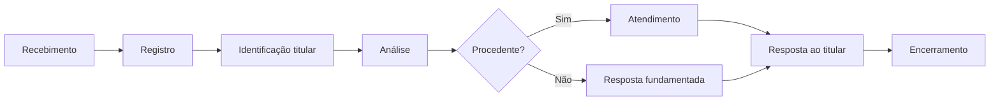

# Processo para Pedidos dos Titulares (Art. 18 LGPD)

**Projeto PINOVARA** — Exercício de direitos dos titulares de dados

---

## 1. Direitos dos Titulares (LGPD, art. 18)

Os titulares de dados pessoais têm os seguintes direitos:

| Direito | Descrição |
|---------|-----------|
| **Confirmação e acesso** | Saber se tratamos seus dados e acessá-los |
| **Correção** | Corrigir dados incompletos, inexatos ou desatualizados |
| **Anonimização, bloqueio ou eliminação** | De dados desnecessários ou tratados em desconformidade |
| **Portabilidade** | Solicitar transferência dos dados a outro fornecedor |
| **Eliminação** | Dos dados tratados com base no consentimento |
| **Informação sobre compartilhamento** | Saber com quem compartilhamos seus dados |
| **Revogação do consentimento** | Quando o consentimento for a base do tratamento |
| **Oposição** | Opor-se a tratamento realizado sem consentimento |

---

## 2. Canal de Recebimento

**Canal principal:** E-mail do DPO  
**E-mail:** jorgefrpsendziuk@gmail.com  
**Assunto sugerido:** "Exercício de Direitos LGPD — PINOVARA"

O titular deve informar:
- Nome completo
- E-mail ou telefone para contato
- Documento (CPF) para identificação
- Tipo de pedido (acesso, correção, exclusão, etc.)
- Descrição do pedido

---

## 3. Fluxo de Atendimento

### 3.1 Etapas

| Etapa | Responsável | Ação |
|-------|-------------|------|
| **Recebimento** | DPO | Receber pedido por e-mail ou formulário |
| **Registro** | DPO | Registrar no sistema (FPSI ou planilha), gerar protocolo |
| **Identificação** | DPO | Verificar identidade do titular (documento, e-mail) |
| **Análise** | DPO + Controlador | Verificar procedência e base legal |
| **Atendimento** | DPO / Operador | Executar o pedido (acesso, correção, exclusão, etc.) |
| **Resposta** | DPO | Responder ao titular dentro do prazo |
| **Encerramento** | DPO | Arquivar documentação |

---

## 4. Prazos (LGPD, art. 18, §3º)

- **Prazo para resposta:** 15 (quinze) dias, prorrogáveis por mais 15 dias mediante justificativa
- **Comunicação:** A resposta deve ser dada de forma clara e acessível

---

## 5. Tipos de Pedido e Procedimento

### 5.1 Acesso aos dados

- Localizar os dados do titular no sistema
- Preparar relatório ou cópia dos dados em formato legível
- Enviar ao titular por canal seguro (e-mail com link temporário, se necessário)

### 5.2 Correção

- Identificar os dados incorretos
- Corrigir no sistema
- Confirmar a correção ao titular

### 5.3 Exclusão

- Verificar se a exclusão é possível (ex.: dados necessários para obrigação legal não podem ser excluídos)
- Se procedente: excluir ou anonimizar os dados
- Confirmar ao titular

### 5.4 Portabilidade

- Exportar os dados em formato estruturado e de uso comum
- Enviar ao titular ou ao novo fornecedor indicado por ele

### 5.5 Revogação de consentimento

- Verificar se o tratamento tem base no consentimento
- Se sim: cessar o tratamento e excluir quando aplicável
- Se não (ex.: política pública): informar que a base legal não é consentimento

### 5.6 Informação sobre compartilhamento

- Identificar com quais entidades públicas e privadas os dados do titular foram compartilhados
- Preparar lista ou relatório com nomes e finalidades do compartilhamento
- Enviar ao titular de forma clara e acessível

### 5.7 Oposição

- Verificar a base legal do tratamento (art. 7º LGPD)
- Se o titular pode opor-se (ex.: legítimo interesse, proteção da vida): avaliar o pedido e, se procedente, cessar o tratamento para aquela finalidade
- Se a base legal não admite oposição (ex.: obrigação legal, política pública): informar fundamentadamente ao titular

### 5.8 Pedido recusado

- Responder por escrito, de forma fundamentada
- Informar que o titular pode recorrer à ANPD

---

## 6. Registro e Controle

O FPSI possui módulo de Pedidos dos Titulares em `programas/[id]/conformidade/pedidos-titulares` para:

- Registrar pedidos (tipo, titular, data, status)
- Definir prazo de resposta
- Acompanhar atendimento
- Exportar relatórios

**Campos recomendados:** protocolo, tipo, nome do titular, e-mail, documento, descrição, status, data de prazo, data de resposta.

---

## 7. Responsabilidades

| Papel | Responsabilidade |
|-------|------------------|
| **DPO** | Receber, registrar, analisar e coordenar o atendimento |
| **Controlador (UFBA/INCRA)** | Decidir sobre pedidos que envolvam interpretação legal; aprovar exclusões |
| **Operador (LGRDC)** | Auxiliar na localização e no tratamento técnico dos dados |

---

## 8. Portal do Titular

O PINOVARA disponibiliza (ou pode disponibilizar) um portal de privacidade em formato `[slug].fpsi...` ou similar, com:

- Link para a política de privacidade
- Formulário para exercício de direitos
- Informações de contato do DPO

---

## 9. Comunicação à ANPD

Em caso de pedido que envolva reclamação ou recurso à ANPD, o controlador deve acompanhar as orientações da autoridade e responder no prazo estabelecido.

---

*Documento de processo — revisar periodicamente.*
