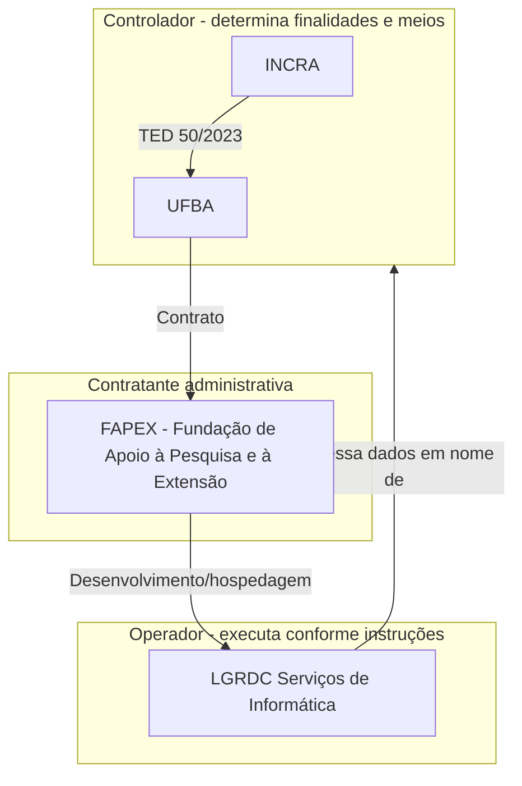

# Programa de Privacidade PINOVARA

Documento consolidado do programa de privacidade do projeto PINOVARA (Pesquisa Inovadora em Gestão do PNRA), parceria INCRA/UFBA via TED nº 50/2023.

---

## 1. Contexto do Projeto

### 1.1 O que é o PINOVARA

O **PINOVARA** (Pesquisa Inovadora em Gestão do PNRA) é uma parceria estratégica entre o Instituto Nacional de Colonização e Reforma Agrária (INCRA) e a Universidade Federal da Bahia (UFBA) por meio do Termo de Execução Descentralizado (TED) nº 50/2023.

**Objetivo:** Desenvolvimento de processos inovadores no georreferenciamento e supervisão ocupacional com coleta de dados socioeconômicos/ambientais de lotes e perímetros em projetos de assentamento federais e regularização fundiária de territórios quilombolas.

**Escopo geográfico:** Bahia, São Paulo e Espírito Santo — impactando mais de 5.000 famílias.

### 1.2 Escopo Atual (em operação)

- **Meta 11:** Qualificação e Formação Profissional — cadastro de capacitações e participantes
- **Meta 12:** Perfil de Entrada e Plano de Gestão — cadastro de organizações, responsáveis e representantes
- **Usuários do sistema:** técnicos, gestores e administradores

### 1.3 Escopo Futuro (planejado)

- **Cadastro de Famílias em territórios:** coleta em campo via tablets, dados pessoais de famílias inteiras, fotos de documentos e propriedades, para suporte fundiário e elaboração de RTID (Relatório Técnico de Identificação).

---

## 2. Papéis e Responsabilidades LGPD

### 2.1 UFBA / INCRA (Controlador)

- Determina as finalidades e os meios do tratamento de dados
- Define bases legais e políticas de retenção
- Responde perante titulares e ANPD

### 2.2 FAPEX (Contratante)

- **FAPEX** — Fundação de Apoio à Pesquisa e à Extensão (Bahia); pessoa jurídica distinta da UFBA e **não** confundir com a FUNARBE (não é “fundação da UFBA” neste arranjo)
- Intermediária contratual no âmbito do TED; canal operacional de contato para titulares espelhado no cadastro do programa (site, e-mail, telefone)
- Garante que o contrato com LGRDC preveja obrigações LGPD
- Papéis de controlador permanecem INCRA/UFBA; FAPEX atua na cadeia administrativa/contratual conforme instrumentos do projeto

### 2.3 LGRDC (Operador)

- Processa dados pessoais em nome do controlador, conforme instruções
- Implementa medidas de segurança técnicas e organizacionais
- Mantém ROPA das atividades que executa
- Auxilia o controlador em pedidos de titulares e incidentes
- Não utiliza os dados para finalidades próprias

---

## 3. ROPA — Registro das Operações de Tratamento

Conforme art. 37 da LGPD. Detalhamento em [ROPA.md](./ROPA.md).

| # | Operação | Finalidade | Base Legal | Status |
|---|----------|------------|------------|--------|
| 1 | Cadastro de usuários do sistema | Autenticação e controle de acesso | Política pública (Art. 7º III) | Ativo |
| 2 | Cadastro de organizações e representantes (Meta 12) | Gestão de organizações participantes | Política pública, execução de contrato | Ativo |
| 3 | Capacitações e participantes (Meta 11) | Qualificação e formação profissional | Política pública, obrigação legal | Ativo |
| 4 | Cadastro de famílias em territórios | RTID, suporte fundiário, regularização | Política pública (Art. 7º III, 11 II) | Planejado |
| 5 | Dados automáticos (logs, navegação, segurança) | Segurança da informação, auditoria, continuidade do serviço | Legítimo interesse com medidas (Art. 7º IX, art. 10) | Ativo |

---

## 4. Política de Privacidade

- **URL:** https://pinovaraufba.com.br/politica-privacidade
- **Última atualização:** 01/03/2026
- **Versão atual:** cobre Metas 11 e 12, usuários do sistema

### Histórico de alterações

| Data | Alteração |
|------|-----------|
| 01/03/2026 | Versão inicial — Metas 11 e 12, usuários |
| *(futuro)* | Inclusão do Cadastro de Famílias e RTID |

### Checklist de adequação para Cadastro de Famílias

Antes de iniciar a coleta em campo, a política deve ser atualizada para incluir:

- [ ] Dados de famílias (membros, documentos, fotos de propriedades)
- [ ] Dados sensíveis em territórios quilombolas (origem racial/étnica)
- [ ] Coleta em campo (tablets, técnicos, offline/sincronização)
- [ ] Finalidade RTID e regularização fundiária
- [ ] Esclarecimento dos papéis (controlador x operador)
- [ ] Termo de consentimento/informação para famílias
- [ ] Prazos de retenção para dados de famílias

---

## 5. Contatos e canal no FPSI

O **Portal da Privacidade** do PINOVARA é o gerado pelo FPSI para o programa (slug `pinovara`), com base nos dados institucionais cadastrados no programa.

**Contato operacional para titulares** segue o cadastro do programa no FPSI — **FAPEX** (Fundação de Apoio à Pesquisa e à Extensão): site https://www.fapex.org.br, ouvidoria@fapex.org.br, (71) 3183-8400 (valores espelhados na migration `20260322190000_programa_pinovara_dados_org_fapex.sql` e no próprio programa).

| Papel | Nome/Entidade | Contato |
|-------|---------------|---------|
| DPO (LGRDC) | Jorge Psendziuk | jorgefrpsendziuk@gmail.com |
| Contato do programa (cadastro FPSI) | FAPEX | Campos no programa + Portal da Privacidade |

### Pacote para atualizar a política no site (Pinovara / IA externa)

Use os dados abaixo como fonte única; o diagrama e o ROPA no FPSI já seguem esta versão.

**Programa (slug `pinovara`)**

| Campo | Valor |
|--------|--------|
| Projeto | PINOVARA — Pesquisa Inovadora em Gestão do PNRA |
| Parceria | INCRA e UFBA — TED nº 50/2023 |
| Razão social (cadastro FPSI) | Fundação de Apoio à Pesquisa e à Extensão |
| Nome fantasia | FAPEX |
| CNPJ | 10.490.525/0001-06 |
| Site institucional do programa | https://www.fapex.org.br |
| E-mail de contato | ouvidoria@fapex.org.br |
| Telefone | (71) 3183-8400 |
| Política de privacidade (URL pública) | https://pinovaraufba.com.br/politica-privacidade |

**Papéis LGPD (texto público)**

- **Controladores:** INCRA e UFBA (finalidades e meios).
- **Contratante administrativa / canal operacional:** FAPEX (não descrever como “fundação da UFBA”; a FAPEX é entidade própria — Fundação de Apoio à Pesquisa e à Extensão).
- **Operador do sistema:** LGRDC Serviços de Informática — processamento sob instrução dos controladores.
- **DPO (referência no FPSI):** Jorge Psendziuk — jorgefrpsendziuk@gmail.com.

**Alterações de texto já alinhadas neste repositório (refletir no site)**

1. Corrigir qualquer menção a FUNARBE como fundação da UFBA ou contratante — substituir pela **FAPEX** conforme tabela acima.
2. Manter papéis de controlador como no sistema (INCRA + UFBA); texto da política deve coincidir com o diagrama LGPD do programa.
3. **Comunicação institucional relacionada ao projeto:** fundir com outra finalidade de comunicação (ex.: prestação de informações sobre o TED e o projeto) para não criar item isolado de baixa relevância.
4. **Dados coletados automaticamente:** incluir secção coerente com a operação 5 do ROPA — logs, navegação, segurança; base legal legítimo interesse; retenção exemplificada (ex.: até 12 meses para logs correntes salvo exigência legal); infraestrutura em GCP Brasil; sem transferência internacional para fins do programa.
5. Atualizar rodapé da política: data de última revisão e versão após incorporar os itens acima.

### Infraestrutura e transferência internacional

Hospedagem e serviços em **Google Cloud Platform (GCP) em região no Brasil**. **Não há** transferência internacional de dados pessoais para fins desse programa.

---

## 6. Documentos Relacionados

- [ROPA.md](./ROPA.md) — Registro detalhado das operações de tratamento
- [DPA_TEMPLATE.md](./DPA_TEMPLATE.md) — Modelo de acordo de processamento de dados
- [ALTERACOES_POLITICA_CADASTRO_FAMILIAS.md](./ALTERACOES_POLITICA_CADASTRO_FAMILIAS.md) — Alterações sugeridas na política antes do Cadastro de Famílias
- [TERMO_CONSENTIMENTO_FAMILIAS.md](./TERMO_CONSENTIMENTO_FAMILIAS.md) — Termo para coleta em campo
- [RIPD_CADASTRO_FAMILIAS.md](./RIPD_CADASTRO_FAMILIAS.md) — Relatório de Impacto (template)
- [GUIA_TREINAMENTO_TECNICOS_CAMPO.md](./GUIA_TREINAMENTO_TECNICOS_CAMPO.md) — Treinamento LGPD para técnicos
- [PROCESSO_PEDIDOS_TITULARES.md](./PROCESSO_PEDIDOS_TITULARES.md) — Fluxo para exercício de direitos (art. 18 LGPD)

---

## Referências

- LGPD (Lei nº 13.709/2018) — arts. 5º, 7º, 11, 37, 39, 41, 43
- [ROTINA_DPO_E_GAPS.md](../essentials/ROTINA_DPO_E_GAPS.md) — fluxo DPO e módulos FPSI
