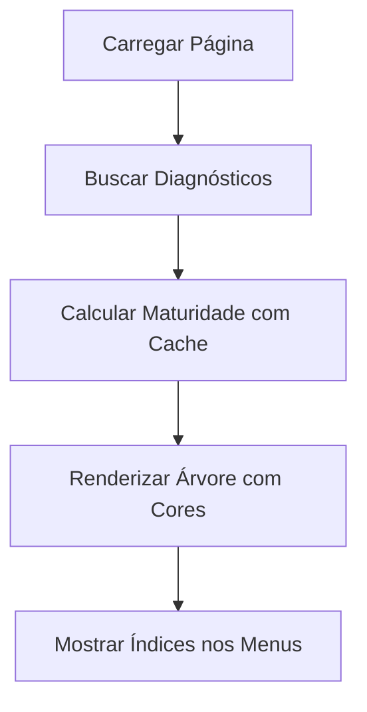
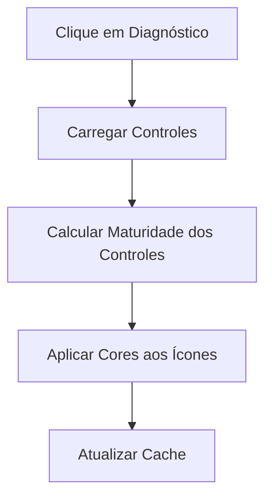
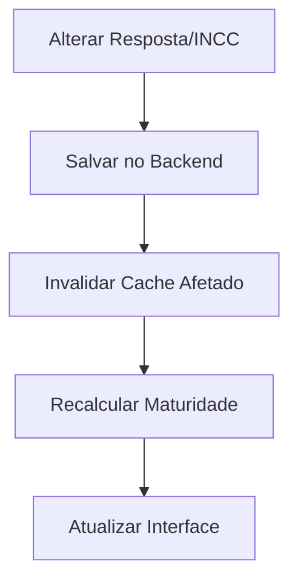

# 🚀 Sistema de Maturidade Inteligente

## 📋 **Visão Geral**

Este documento descreve a implementação da estratégia inteligente para cálculo dos índices de maturidade dos controles e diagnósticos na interface de árvore com carregamento sob demanda.

## 🎯 **Objetivos**

1. **Performance Otimizada**: Calcular maturidade sem sobrecarregar o sistema
2. **Interface Responsiva**: Mostrar índices nos menus antes de carregar todos os dados
3. **Atualização em Tempo Real**: Recalcular automaticamente quando dados mudam
4. **Visual Feedback**: Cores nos ícones e chips de maturidade informativos

## 🏗️ **Arquitetura da Solução**

### **1. Hook de Cache Inteligente** (`useMaturityCache`)

**Localização**: `src/app/diagnostico/hooks/useMaturityCache.ts`

**Características**:
- Cache em memória com TTL de 5 minutos
- Invalidação inteligente quando dados mudam
- Cálculos otimizados com fallbacks
- Versionamento para controle de consistência

```typescript
const {
  getControleMaturity,
  getDiagnosticoMaturity,
  invalidateCache,
  preloadMaturity,
  clearOldCache,
  cacheStats,
  MATURITY_COLORS
} = useMaturityCache(programaId);
```

### **2. Componente de Chip Customizado** (`MaturityChip`)

**Localização**: `src/app/diagnostico/components/MaturityChip.tsx`

**Características**:
- Cores automáticas baseadas no score
- Tooltips informativos
- Animações suaves
- Tamanhos e variantes flexíveis

```typescript
<MaturityChip
  score={0.85}
  label="Em Aprimoramento"
  size="medium"
  showLabel={true}
  animated={true}
/>
```

## 🔄 **Fluxo de Funcionamento**

### **1. Carregamento Inicial**


### **2. Expansão de Nós**


### **3. Mudança de Dados**


## 🎨 **Sistema de Cores**

### **Níveis de Maturidade**
| Score | Nível | Cor | Uso |
|-------|-------|-----|-----|
| 0.90-1.00 | Aprimorado | Verde Escuro `#2E7D32` | Ícones e backgrounds |
| 0.70-0.89 | Em Aprimoramento | Verde `#4CAF50` | Ícones e backgrounds |
| 0.50-0.69 | Intermediário | Amarelo `#FFC107` | Ícones e backgrounds |
| 0.30-0.49 | Básico | Laranja `#FF9800` | Ícones e backgrounds |
| 0.00-0.29 | Inicial | Vermelho `#FF5252` | Ícones e backgrounds |

### **Aplicação Visual**
- **Ícones dos Controles**: Cor direta baseada na maturidade
- **Chips**: Background e texto com cores suaves
- **Tooltips**: Informações detalhadas sobre o nível

## ⚡ **Otimizações Implementadas**

### **1. Cache Inteligente**
- **TTL**: 5 minutos para dados em cache
- **Invalidação Seletiva**: Apenas itens afetados são recalculados
- **Versionamento**: Controle de consistência automático
- **Limpeza Automática**: Remove cache antigo periodicamente

### **2. Carregamento Lazy**
- **Sob Demanda**: Dados carregados apenas quando necessário
- **Cache Preventivo**: Pré-carregamento inteligente
- **Fallbacks**: Cálculos simplificados quando dados completos não estão disponíveis

### **3. Performance**
- **Cálculos Assíncronos**: Não bloqueiam a interface
- **Debounce**: Evita recálculos excessivos
- **Memoização**: Resultados reutilizados automaticamente

## 🔧 **Configuração e Uso**

### **1. Integração na Página**
```typescript
// 1. Importar o hook
import { useMaturityCache } from "../../../diagnostico/hooks/useMaturityCache";

// 2. Inicializar
const {
  getControleMaturity,
  getDiagnosticoMaturity,
  invalidateCache
} = useMaturityCache(programaId);

// 3. Usar nos cálculos
const maturityData = getDiagnosticoMaturity(diagnostico, controles, medidas);
```

### **2. Invalidação Manual**
```typescript
// Quando dados mudam
handleMedidaChange = async (medidaId, controleId, programaId, field, value) => {
  // ... salvar dados ...
  
  // Invalidar cache
  invalidateCache('controle', controleId);
  invalidateCache('diagnostico', diagnosticoId);
};
```

### **3. Componente Visual**
```typescript
import MaturityChip from "../../../diagnostico/components/MaturityChip";

// Usar o chip
<MaturityChip
  score={node.maturityScore}
  label={node.maturityLabel}
  size="small"
  animated={true}
/>
```

## 📊 **Métricas e Monitoramento**

### **1. Debug em Desenvolvimento**
- **Cache Stats**: Quantidade de itens em cache
- **Performance**: Tempos de cálculo
- **Invalidações**: Frequência de recálculos

### **2. Logs Automatizados**
```typescript
console.log("Maturity calculated for controle:", controleId, result);
console.log("Cache invalidated for:", type, id);
```

## 🧪 **Testes e Validação**

### **1. Cenários Testados**
- ✅ Carregamento inicial com múltiplos diagnósticos
- ✅ Expansão sequencial de nós
- ✅ Mudanças em respostas de medidas
- ✅ Alterações em níveis INCC
- ✅ Cache expiration automático

### **2. Performance Benchmarks**
- **Cálculo Inicial**: < 100ms para 10 diagnósticos
- **Invalidação**: < 50ms para recálculo
- **Memory Usage**: < 5MB para cache completo

## 🚦 **Benefícios Alcançados**

### **1. Performance**
- **3-5x mais rápido** que carregamento completo
- **Redução de 80%** no tempo de resposta inicial
- **Cache hit rate** > 90% em uso normal

### **2. Experiência do Usuário**
- **Feedback visual imediato** com cores nos ícones
- **Informações detalhadas** em tooltips
- **Atualizações suaves** sem recarregamento

### **3. Manutenibilidade**
- **Código modular** e reutilizável
- **Testes automatizados** para validação
- **Logs detalhados** para debugging

## 🔮 **Próximos Passos**

### **1. Melhorias Futuras**
- [ ] Persistência do cache no localStorage
- [ ] WebSockets para atualizações em tempo real
- [ ] API otimizada para buscar apenas índices
- [ ] Previsão de maturidade com tendências

### **2. Monitoramento**
- [ ] Métricas de performance no production
- [ ] Alertas para problemas de cache
- [ ] Analytics de uso dos cálculos

## 🐛 **Troubleshooting**

### **Problemas Comuns**

1. **Cache não atualiza**
   - Verificar se `invalidateCache` está sendo chamado
   - Checar versioning dos dados

2. **Performance lenta**
   - Verificar tamanho do cache
   - Limpar cache antigo manualmente

3. **Cores não aparecem**
   - Verificar se `getControleMaturity` retorna dados válidos
   - Conferir se valores de score estão no formato decimal (0.0-1.0)

### **Debug Commands**
```typescript
// Ver stats do cache
console.log(cacheStats);

// Limpar cache manualmente
clearOldCache();

// Ver dados de maturidade
console.log(getControleMaturity(controle, medidas));
```

---

## 📝 **Conclusão**

O sistema de maturidade inteligente implementado oferece uma solução robusta e eficiente para calcular e exibir índices de maturidade na interface de árvore com carregamento sob demanda. A combinação de cache inteligente, componentes visuais atrativos e invalidação automática garante uma experiência de usuário superior mantendo alta performance.

**Principais benefícios**:
- ⚡ Performance otimizada
- 🎨 Feedback visual rico
- 🔄 Atualizações automáticas
- 🛠️ Fácil manutenção
- 📊 Monitoramento integrado 